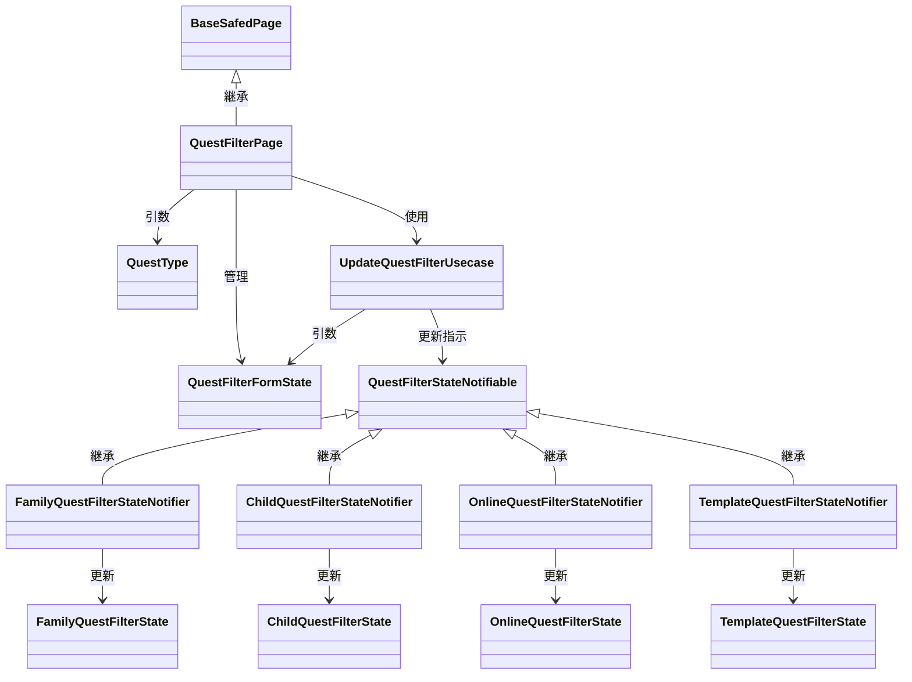
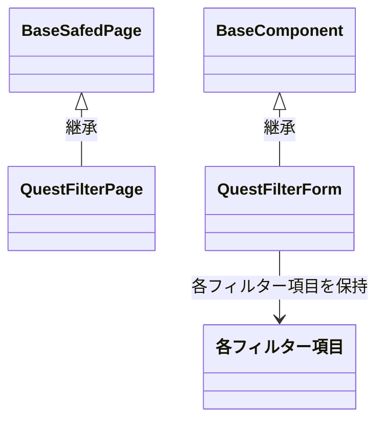

# クエスト検索画面

## 概要
以下画面から遷移されることを想定
- 家族クエスト一覧画面
- 子供クエスト一覧画面
- オンラインクエスト一覧画面
- テンプレート選択画面

## 画面引数
- QuestType: クエストの種類(家族、子供、オンライン、テンプレート)(enum QuestType)

## 画面項目
### ヘッダー
- タイトル: クエスト検索
- 戻るボタン: 前の画面に戻る

### フィルター
（一旦以下のみ実装）
- クエスト名: テキストフィールド(全タイプ共通)
- 公開非公開: チェックボックス(親・子供)
- 報酬額: スライダー（共通）
- 家名: テキストフィールド（オンライン・テンプレート）

### ボタン群
- リセットボタン
- 検索ボタン

## イベント
- 戻るボタン: 前の画面に戻る
- リセットボタン: フィルター項目を初期化
- 検索ボタン: QuestTypeに応じて、`QuestFilterStateNotifier`を使用する
  - family: `FamilyQuestFilterStateNotifier`
  - child: `ChildQuestFilterStateNotifier`
  - online: `OnlineQuestFilterStateNotifier`
  - template: `TemplateQuestFilterStateNotifier`

## データ取得
- なし

## クラス図

### `QuestFilterFormState`
- 入力されたフィルター項目を保持する
- 画面項目のフィルターに対応する値を持つ
- このクラスを`QuestFilterStateNotifier`に渡し、`QuestFilterState`を更新する

### `QuestFilterState`
- クエスト検索画面で使用するフィルター状態を管理する
- 以下のフィールドを持つ
  - questName: 検索するクエスト名
  - isPublic: 公開非公開のチェックボックス状態
  - rewardAmount: 報酬額のスライダー値
- 以下種類がある
  - family: `FamilyQuestFilterState`
  - child: `ChildQuestFilterState`
  - online: `OnlineQuestFilterState`
  - template: `TemplateQuestFilterState`

### `QuestFilterStateNotifiable<T>`
- クエスト検索画面で使用するフィルター状態を管理するインターフェース
- `T`は`QuestFilterState`のサブクラス
- 以下のメソッドを持つ
  - `updateQuestFilterState(T state)`: フィルター状態を更新する

### `QuestFilterStateNotifier`
- クエスト検索画面で使用するフィルター状態を管理する
- 以下種類がある
  - family: `FamilyQuestFilterStateNotifier`
  - child: `ChildQuestFilterStateNotifier`
  - online: `OnlineQuestFilterStateNotifier`
  - template: `TemplateQuestFilterStateNotifier`
- `QuestFilterStateNotifier`を継承し、`QuestFilterState`を管理する

### `UpdateQuestFilterUsecase`
- クエスト検索画面で使用するフィルター状態を更新するUsecase
- Notifierを使用して、フィルター状態を更新する
- 引数のCommandオブジェクトは以下を持つ
  - `QuestType`: クエストの種類(QuestType)
  - `QuestFilterForm`: 
    - 画面項目に対応する値を持つ
- executeメソッドの処理
  - Notifierの`updateQuestFilterState`メソッドを呼び出す
  - 

## ウィジェットクラス図

### `BaseFilterQuestWidget`クラス
- 各`QuestType`に応じたコンポーネントを親が渡すことによって、各タイプの表示を制御する
