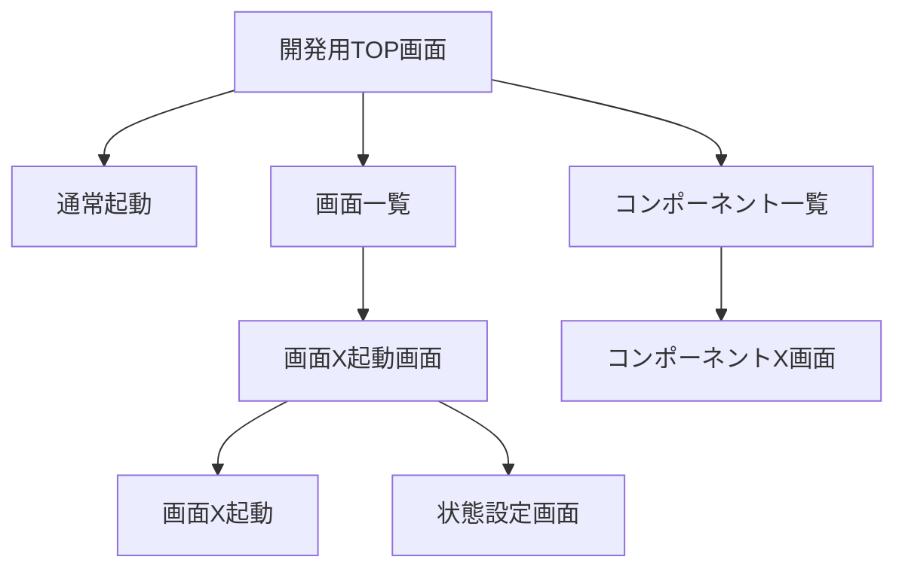

## 画面遷移図

## 開発用TOP画面
- 通常起動ボタン: 通常のアプリ起動
- 画面一覧ボタン: 画面一覧へ遷移

## 画面一覧
- 各画面の起動画面へ遷移

## 画面X起動画面
- 起動ボタン: 対象の画面を起動
- 状態設定画面へ遷移: 対象画面の状態を設定するための画面へ遷移
  - セッション状態の設定: GUIでセッション状態を設定
  - 対象画面の状態設定: GUIで対象画面の状態を設定

## コンポーネント一覧
- 各コンポーネントの画面へ遷移

## コンポーネントX画面
- コンポーネントの詳細表示
- 下部: 
  - コンポーネントの引数設定
  - 引数反映ボタン: コンポーネントの引数でコンポーネントを更新
