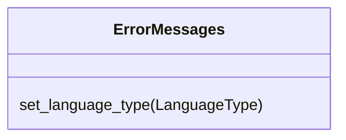

[indexへ戻る](../index.md)
# 🔍 共通メッセージ管理

## 概要
- エラーメッセージやクライアントに返すメッセージの定義方法

## オブジェクト図

```mermaid
classDiagram
    class ErrorMessages {
        set_language_type(LanguageType)
    }
```

## `ErrorMessages`クラス
### 概要
- エラーメッセージを管理するクラス

### 配置場所
- 

### 命名規則
- 
