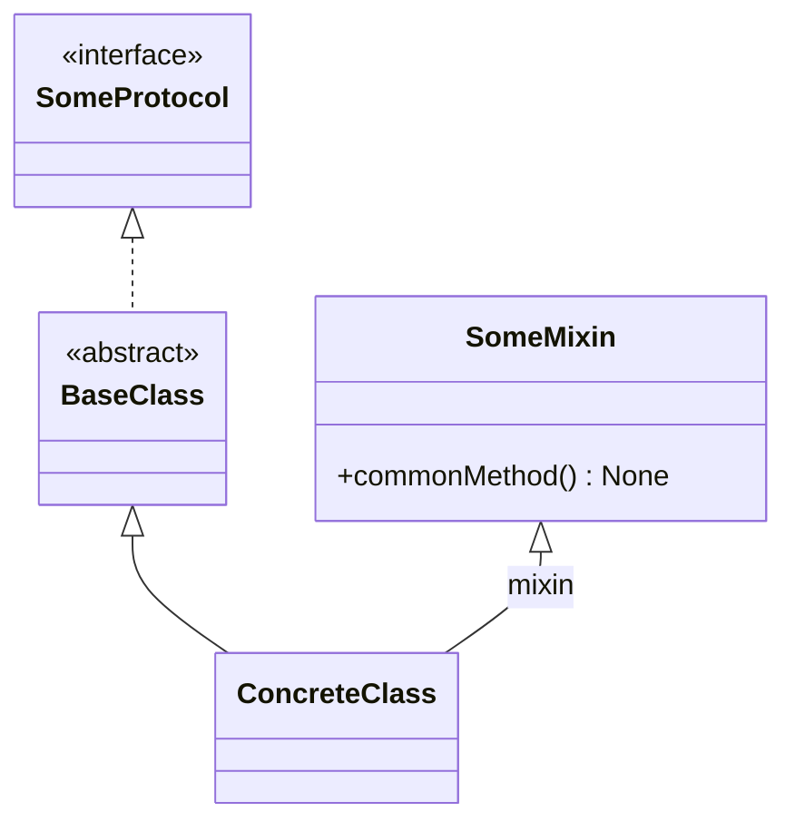
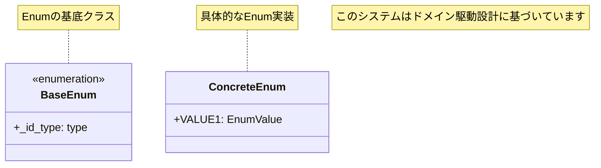
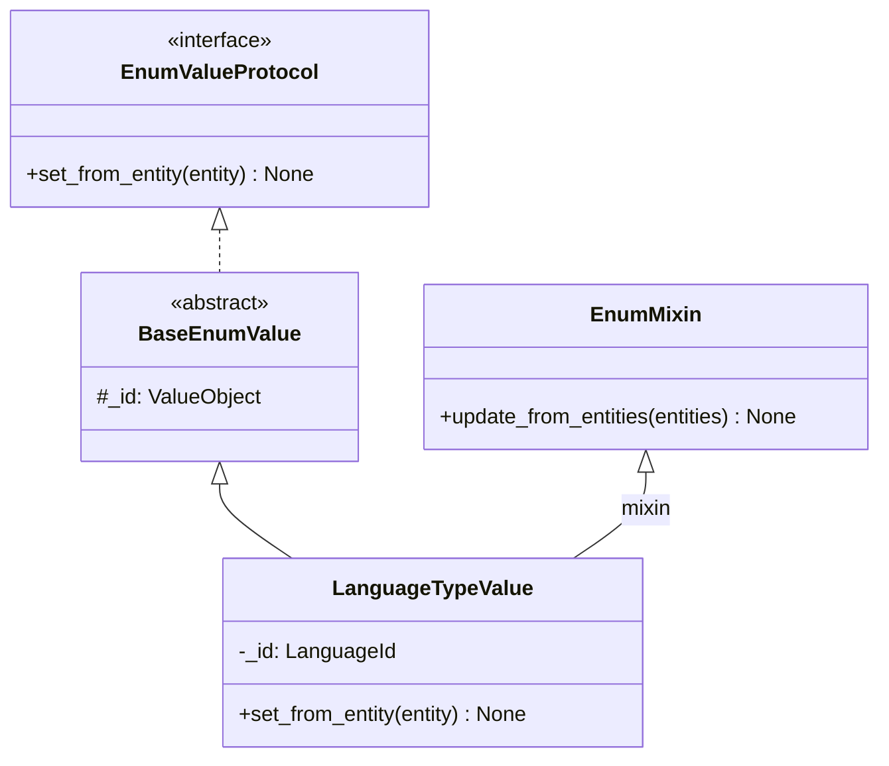

# 📊 図表・ダイアグラム作成ルール

## 概要
このドキュメントでは、プロジェクト内で図表やダイアグラム（特にMermaidクラス図・UML）を作成する際の統一ルールを定義します。

## Mermaidクラス図のルール

### 1. 基本設定

#### 方向設定
- **デフォルト**: クラス図は縦向き（Top to Bottom）で作成する
- 必要に応じて`direction TB`を明記（省略可能）

#### レイアウト
- 親クラス・インターフェース・プロトコルは**上側（上位）**に配置
- 子クラス・実装クラスは**下側（下位）**に配置
- 継承関係が一目で分かるようにする

### 2. 配置ルール

#### 継承関係の配置順序
1. **最上**: プロトコル・インターフェース（`<<interface>>`）
2. **上寄り**: 抽象基底クラス（`<<abstract>>`）、Mixinクラス
3. **中央**: 具体実装クラス
4. **下寄り**: 値オブジェクト・エンティティ

#### 例：理想的な配置
```
  Protocol
     ↓
  BaseClass / Mixin
     ↓
 ConcreteClass
     ↓
 ValueObject
```

### 3. クラス図の構造化

#### グループ化のコメント
- 機能別にコメントでグループ化する
- `%% コメント`形式で区切る



#### 関係性の表現
- 継承: `<|--` （必ず上から下へ）
- 実装: `..|>` または `<|..` （必ず上から下へ）
- Mixin: `<|--` + `: mixin`ラベル （必ず上から下へ）
- 組合せ: `o--` （含む側から含まれる側へ）
- 依存: `..>` （依存する側から依存される側へ）

### 4. 命名・表記規約

#### クラス表記
- プロトコル: `<<interface>>`アノテーション
- 抽象クラス: `<<abstract>>`アノテーション
- Enum: `<<enumeration>>`アノテーション
- サービス: `<<service>>`アノテーション

#### メンバー表記
- Public: `+`
- Private: `-`
- Protected: `#`
- Package: `~`

#### メソッド表記
- 抽象メソッド: `methodName()*`
- 静的メソッド: `methodName()$`

#### ノート（説明）の追加
- クラスの説明: `note for ClassName "説明文"`
- 全体の説明: `note "説明文"`



## UMLダイアグラム全般のルール

### 1. 一貫性の保持
- 同一プロジェクト内では同じスタイル・配置ルールを使用
- クラス名・メソッド名は実際のコードと一致させる

### 2. 可読性の重視
- 複雑な図は複数の図に分割する
- 重要な関係性を強調表示する
- コメントで説明を補完する

### 3. メンテナンス性
- コード変更時は対応する図も更新する
- 図のバージョン管理を行う
- レビューで図の正確性もチェックする

## シーケンス図のルール

### 1. 方向設定
- 基本的に上から下（Top to Bottom）
- 必要に応じて`direction TB`を明記

### 2. アクター配置
- 左側: ユーザー・外部システム
- 中央: アプリケーション層
- 右側: インフラ層・データベース

## フローチャートのルール

### 1. 方向設定
- 基本的に上から下（Top to Bottom）
- 複雑な分岐がある場合は左から右（Left to Right）

### 2. 要素の統一
- 開始/終了: 角丸四角形
- 処理: 四角形
- 判定: ひし形
- データ: 平行四辺形

## 実例

### 良い例：Domain Enum System


## 参考ドキュメント
- 🎛️ [Domain Enum System](../../../apps/api/docs/ja/modules/domain-enum-system.md) - 実際のクラス図例
- 🏗️ [アーキテクチャ責務](../architecture/responsibilities.md) - レイヤー構造
- 📝 [Mermaid公式ドキュメント](https://mermaid.js.org/)
