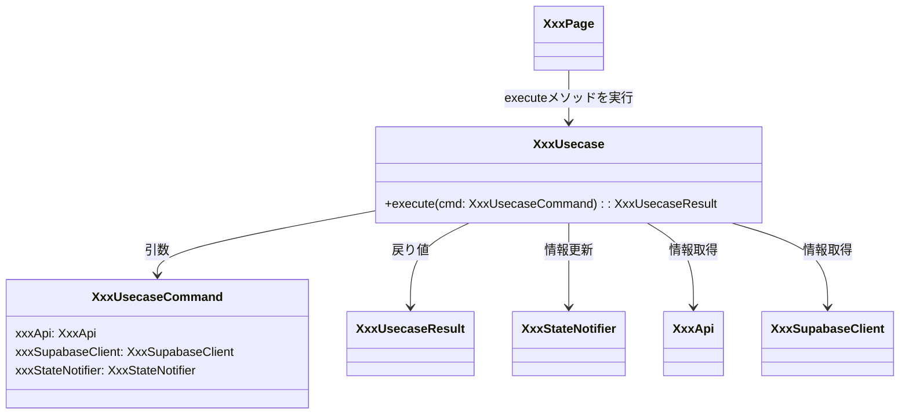

[indexへ戻る](../index.md)
# 🔍 ユースケース

## 概要
- ユースケースクラスはFlutterの画面が使用するビジネスロジックのファサードクラス
  - ビジネスロジッククラスの例:
    - [ApiClient](APIクライアント-apiclient.md)
    - [StateNotifier](状態管理-state.md)

## オブジェクト図

## `XxxUsecase`クラス
### 概要
- `usecase`クラスは一つのメソッドに対して一つのクラスとする
- 公開メソッドは`execute`のみとする
- `execute`メソッドは、引数に`XxxUsecaseCommand`を受け取り、戻り値に`XxxUsecaseResult`を返す
- 画面は`XxxUsecase`からのみ状態の更新やビジネスロジックを行うこと

### 配置場所
- `{関心事名}/usecase/xxx/xxx_usecase.dart`
- ユースケースごとに一つのフォルダを作成し、中に以下を配置すること
  - `xxx_usecase.dart`
  - `xxx_usecase_command.dart`
  - `xxx_usecase_result.dart`
  - `xxx_usecase.md` (クラス図)
- 例: `quest/usecase/get_quest/get_quest_usecase.dart`

### 命名規則
- `XxxUsecase`の形式で命名すること
- `Xxx`は動詞を使用すること
  - 例: `FetchQuestSummaryUsecase`, `UpdateFamilyMemberUsecase`

- `Command`クラスのインスタンス名は`cmd`とすること
  - 例: `FetchQuestSummaryUsecaseCommand cmd`

## `XxxUsecaseCommand`クラス
### 概要
- `XxxUsecase`の引数を定義するクラス
- DIコンテナは使用しないため、以下クラスはCommandクラス経由で依存性注入を行う
  - `ApiClient`
  - `SupabaseClient`
  - `StateNotifier`

### 命名規則
- `{ユースケースクラス名}Command`の形式で命名すること
  - 例: `FetchQuestSummaryUsecaseCommand`, `UpdateFamilyMemberUsecaseCommand`

## `XxxUsecaseResult`クラス
### 概要
- `XxxUsecase`の戻り値を定義するクラス

### 命名規則
- `{ユースケースクラス名}Result`の形式で命名すること
  - 例: `FetchQuestSummaryUsecaseResult`, `UpdateFamilyMemberUsecaseResult` 
