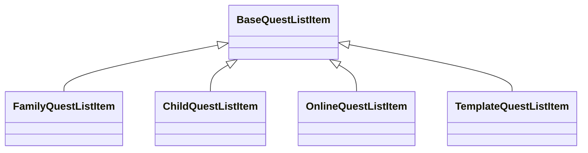
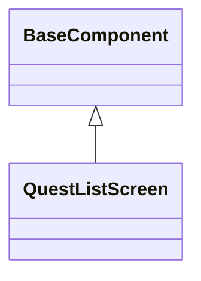

# クエスト一覧画面_コンポーネント

## 目次
- [目次](#目次)
- [クエストレベルラベル](#クエストレベルラベル)
- [クエスト一覧アイテム](#クエスト一覧アイテム)
  - [クラス図](#クラス図)
  - [概要](#概要)
  - [抽象メソッド](#抽象メソッド)
  - [共通プロパティ](#共通プロパティ)
  - [FamilyQuestListItem](#familyquestlistitem)
  - [ChildQuestListItem](#childquestlistitem)
  - [OnlineQuestListItem](#onlinequestlistitem)
  - [TemplateQuestListItem](#templatequestlistitem)
- [クエストステータスタグ](#クエストステータスタグ)
- [家族メンバーアイコンリスト](#家族メンバーアイコンリスト)
- [テンプレート共有者ラベル](#テンプレート共有者ラベル)
- [コメント・いいねアイコンペア](#コメントいいねアイコンペア)
- [検索エリア](#検索エリア)
- [クエスト一覧スクリーン](#クエスト一覧スクリーン)
  - [クラス図](#クラス図-1)
  - [概要](#概要-1)
  - [コンストラクタ](#コンストラクタ)
  - [render()](#render)
  - [クエストカテゴリタブ押下時](#クエストカテゴリタブ押下時)

## クエストレベルラベル
- クラス名: `QuestLevelLabel`
- 説明: クエストの難易度レベルを星の数で表示する
- 引数: `QuestLevel`

## クエスト一覧アイテム
### クラス図

### 概要
- 基底クラス名: `BaseQuestListItem`
- 説明: クエスト一覧のアイテムウィジェット
  - 各パターンに対応するため、基底クラスを定義し、各ページで継承して使用する

### 抽象メソッド
- get topLeftIcon(): Widget
  - アイテムの左上に表示するアイコンを取得する。
- get topRightIcon(): Widget
  - アイテムの右上に表示するアイコンを取得する。
- get bottomLeftWidget(): Widget
  - アイテムの左下に表示するウィジェットを取得する。
- get bottomRightWidget(): Widget
  - アイテムの右下に表示するウィジェットを取得する。
- get statusWidget(): Widget?
  - ステータス表示用のウィジェットを取得する（オプション）。

### 共通プロパティ
- questIcon: Widget - クエストアイコン
- questTitle: String - クエストタイトル
- questReward: String - クエスト報酬（「報酬: XX円」形式）
- onTap: VoidCallback - タップ時のコールバック

### FamilyQuestListItem
- 継承元: `BaseQuestListItem`
- 説明: 家族画面用のクエストリストアイテム
- 画面固有の要素:
  - topLeftIcon: クエスト公開非公開フラグ
  - topRightIcon: 地球アイコン（公開時のみ）
  - bottomLeftWidget: 家族メンバーアイコンリスト
  - bottomRightWidget: 空
  - statusWidget: クエストステータスタグ

### ChildQuestListItem
- 継承元: `BaseQuestListItem`
- 説明: 子供画面用のクエストリストアイテム
- 画面固有の要素:
  - topLeftIcon: クエスト公開非公開フラグ
  - topRightIcon: 空
  - bottomLeftWidget: 空
  - bottomRightWidget: クエストレベル（星アイコン）
  - statusWidget: クエストステータスタグ

### OnlineQuestListItem
- 継承元: `BaseQuestListItem`
- 説明: オンライン画面用のクエストリストアイテム
- 画面固有の要素:
  - topLeftIcon: クエスト公開非公開フラグ
  - topRightIcon: 地球アイコン
  - bottomLeftWidget: 家族メンバーアイコンリスト
  - bottomRightWidget: コメント・いいねアイコン
  - statusWidget: なし
- 追加プロパティ:
  - templateSharer: String? - テンプレート共有者（テンプレートの場合）

### TemplateQuestListItem
- 継承元: `BaseQuestListItem`
- 説明: テンプレート画面用のクエストリストアイテム
- 画面固有の要素:
  - topLeftIcon: クエスト公開非公開フラグ
  - topRightIcon: 空
  - bottomLeftWidget: テンプレート共有者ラベル
  - bottomRightWidget: コメント・いいねアイコン
  - statusWidget: なし
- 追加プロパティ:
  - templateSharer: String - テンプレート共有者

## クエストステータスタグ
- クラス名: `QuestStatusTag`
- 説明: クエストの進行状況を示すカラフルなステータスタグ
- 引数: `QuestStatus` - ステータス値
- 表示パターン:
  - 公開中: 赤色背景
  - 進行中: オレンジ色背景
  - クリア: 青色背景
  - 報告中: 紫色背景
  - 未公開: グレー色背景

## 家族メンバーアイコンリスト
- クラス名: `FamilyMemberIconList`
- 説明: 家族メンバーのアイコンを横並びで表示する
- 引数: `List<FamilyMemberIcon>` - 家族メンバーアイコンのリスト
- 最大表示数: 4個（それ以上は「+N」で表示）

## テンプレート共有者ラベル
- クラス名: `TemplateSharerLabel`
- 説明: 「テンプレート」ラベルを表示する
- 固定テキスト: 「テンプレート」

## コメント・いいねアイコンペア
- クラス名: `CommentLikeIconPair`
- 説明: コメントアイコンといいねアイコンを横並びで表示する
- 引数: `int commentCount` - コメント数
- 引数: `int likeCount` - いいね数
- 引数: `VoidCallback? onCommentTap` - コメントタップ時のコールバック
- 引数: `VoidCallback? onLikeTap` - いいねタップ時のコールバック

## 検索エリア
- クラス名: `QuestSearchArea`
- 説明: 検索条件選択と検索テキストフィールドを含むエリア
- 引数: `String selectedCondition` - 選択中の検索条件
- 引数: `List<String> conditions` - 検索条件リスト
- 引数: `String searchText` - 検索テキスト
- 引数: `Function(String) onConditionChanged` - 検索条件変更時のコールバック
- 引数: `Function(String) onSearchTextChanged` - 検索テキスト変更時のコールバック

## クエスト一覧スクリーン
### クラス図

### 概要
- クエスト分類タブは、クエスト一覧画面の上部に配置され、クエストを分類するためのタブバー
- クエスト分類Entityから取得した情報をセットする
- 対応するタブバービューには、指定された分類のクエストが表示される

### コンストラクタ
- 引数: `QuestCategories`
  - クエスト分類のリスト
- 引数: `BaseQuestListItem`
  - クエスト一覧のアイテムウィジェット
- 引数: `QuestFilterNotifiable`
  - クエストフィルターの更新を通知するためのインターフェース

### render()
- クエスト分類タブバーを表示する
- クエストリストを表示する
- 受け取ったクエストリストアイテムを表示する

### クエストカテゴリタブ押下時
- QuestFilterNotifiable.updateQuestCategory(QuestCategory)
  - 選択されたクエストカテゴリを更新する
  - [クエスト一覧画面_状態管理](QuestListPage_状態管理.md)を参照
