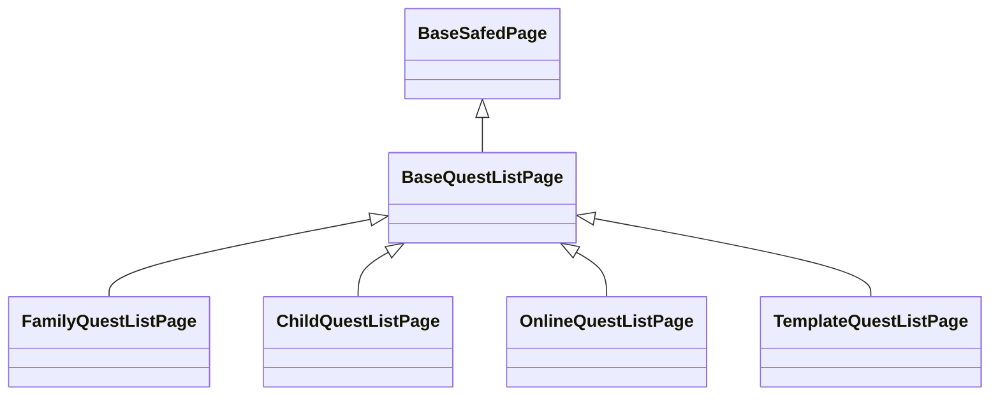

# {画面名}: ページ設計

## 目次

## クラス図

## BaseQuestListPage
### 概要
- クエスト一覧画面の基底クラス
- 共通の部品を定義し、各ページ独自の機能は抽象メソッドを通じて実装する

### build()
- アプリバー
  - 戻るボタン
  - タイトル:
- トップタブバー
  - クエスト分類タブバー
- コンテンツエリア
  - クエストリスト
- フローティングアクションボタン
  - クエスト作成ボタン

### 抽象メソッド
- get title(): String
  - 画面のタイトルを取得する。
- get actionButtons(): List<Widget>
  - アプリバーのアクションボタンを取得する。
- get questListItem(): BaseQuestListItem
  - クエスト一覧のアイテムウィジェットを取得する。

## FamilyQuestListPage
### 概要
- 家族クエスト一覧画面
- `BaseQuestListPage`を継承し、家族クエストに特化した機能を実装する
- 親IDでログインした際に表示されるクエスト一覧画面

### get title()
- 固定値: "家族クエスト一覧"

### get actionButtons()
- [検索ボタン](./クエスト一覧画面_ページ.md#検索ボタン)
- [設定ボタン](./クエスト一覧画面_ページ.md#設定ボタン)

### get questCategoryTab()

## ChildQuestListPage

## OnlineQuestListPage

## TemplateQuestListPage
