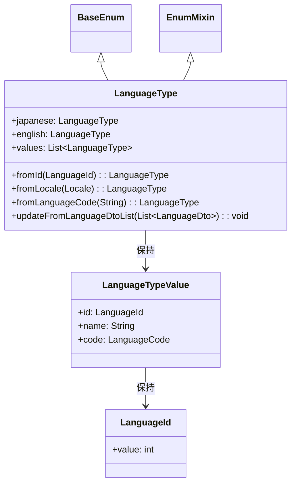

# Language_Enum

## 目次
- [目次](#目次)
- [LanguageType](#languagetype)
  - [クラス図](#クラス図)
  - [概要](#概要)
  - [定義値](#定義値)
  - [主要メソッド](#主要メソッド)
  - [使用例](#使用例)

## LanguageType
### クラス図


### 概要
- システムで使用可能な言語を管理するEnum
- BaseEnumとEnumMixinを継承した疑似Enum
- 多言語対応機能の基盤となるクラス
- Flutter内部のLocaleオブジェクトとの相互変換をサポート

### 定義値
| 言語名 | ID | 言語コード | デフォルト名 |
|--------|----|-----------|-----------| 
| japanese | 1 | ja | 日本語 |
| english | 2 | en | English |

### 主要メソッド

#### fromId(LanguageId id)
- 説明: 言語IDから対応する言語タイプを取得
- 引数: `LanguageId id` - 言語ID
- 戻り値: `LanguageType` - 該当する言語タイプ
- 例外: `ArgumentError` - IDが見つからない場合

#### fromLocale(Locale locale)
- 説明: Flutter内部のLocaleオブジェクトから言語タイプを取得
- 引数: `Locale locale` - Flutter内部のLocaleオブジェクト
- 戻り値: `LanguageType` - 該当する言語タイプ（見つからない場合は日本語）

#### fromLanguageCode(String languageCode)
- 説明: 言語コードから言語タイプを取得
- 引数: `String languageCode` - 言語コード（"ja", "en"など）
- 戻り値: `LanguageType` - 該当する言語タイプ（見つからない場合は日本語）

#### updateFromLanguageDtoList(List<LanguageDto> languageDtoList)
- 説明: APIから取得したDTOリストでEnum値を更新
- 引数: `List<LanguageDto> languageDtoList` - 言語DTOのリスト
- 戻り値: void

### 使用例
```dart
// IDから取得
final language = LanguageType.fromId(LanguageId(1)); // japanese

// 言語コードから取得
final langFromCode = LanguageType.fromLanguageCode("en"); // english

// Localeから取得
final langFromLocale = LanguageType.fromLocale(Locale("ja")); // japanese

// デフォルト取得（見つからない場合）
final defaultLang = LanguageType.fromLanguageCode("fr"); // japanese（デフォルト）

// API更新
LanguageType.updateFromLanguageDtoList(languageDtoList);
```
