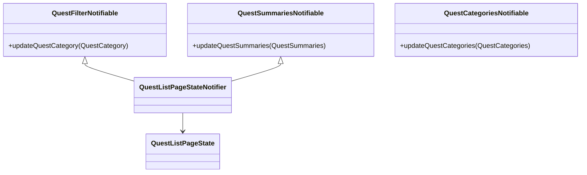

# クエスト一覧画面_状態管理

## 目次

## クラス図

## QuestListPageState
### 概要
- クエスト一覧画面の状態を表すクラス

## QuestListPageStateNotifier
### 概要
- クエスト一覧画面の状態を管理するクラス

## QuestFilterNotifiable
### 概要
- クエストフィルター構造体の更新を行うためインターフェース

## QuestSummariesNotifiable
### 概要
- クエストサマリー構造体の更新を行うためのインターフェース
