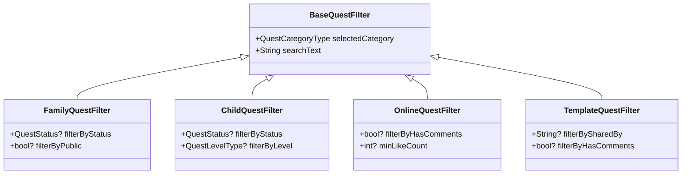

# クエスト一覧画面_QuestFilter

## 目次
- [目次](#目次)
- [クラス図](#クラス図)
- [BaseQuestFilter](#basequestfilter)
  - [概要](#概要)
  - [メンバ](#メンバ)
  - [用途](#用途)
- [FamilyQuestFilter](#familyquestfilter)
  - [継承元](#継承元)
  - [追加メンバ](#追加メンバ)
  - [用途](#用途-1)
- [ChildQuestFilter](#childquestfilter)
  - [継承元](#継承元-1)
  - [追加メンバ](#追加メンバ-1)
  - [用途](#用途-2)
- [OnlineQuestFilter](#onlinequestfilter)
  - [継承元](#継承元-2)
  - [追加メンバ](#追加メンバ-2)
  - [用途](#用途-3)
- [TemplateQuestFilter](#templatequestfilter)
  - [継承元](#継承元-3)
  - [追加メンバ](#追加メンバ-3)
  - [用途](#用途-4)

## クラス図

## BaseQuestFilter
### 概要
- クエストフィルター機能の基底クラス
- 各画面共通のフィルター機能を提供
- 画面固有のフィルター項目は継承クラスで追加

### メンバ
- QuestCategoryType selectedCategory: 選択中のカテゴリ
- String searchText: 検索テキスト

### 用途
- 全画面共通のフィルター機能
- 基底クラスとして継承利用
- カテゴリ選択とテキスト検索の基本機能を提供

## FamilyQuestFilter
### 継承元
- BaseQuestFilter

### 追加メンバ
- QuestStatus? filterByStatus: ステータスフィルター
- bool? filterByPublic: 公開状態フィルター

### 用途
- 家族画面専用のフィルター機能
- ステータス（公開中、進行中、クリア、報告中、未公開）での絞り込み
- 公開/非公開での絞り込み

## ChildQuestFilter
### 継承元
- BaseQuestFilter

### 追加メンバ
- QuestStatus? filterByStatus: ステータスフィルター
- QuestLevelType? filterByLevel: レベルフィルター

### 用途
- 子供画面専用のフィルター機能
- ステータスでの絞り込み
- 難易度レベル（星1〜5）での絞り込み

## OnlineQuestFilter
### 継承元
- BaseQuestFilter

### 追加メンバ
- bool? filterByHasComments: コメント有無フィルター
- int? minLikeCount: 最小いいね数フィルター

### 用途
- オンライン画面専用のフィルター機能
- コメントが付いているクエストでの絞り込み
- いいね数での絞り込み（人気度フィルター）

## TemplateQuestFilter
### 継承元
- BaseQuestFilter

### 追加メンバ
- String? filterBySharedBy: 共有者フィルター
- bool? filterByHasComments: コメント有無フィルター

### 用途
- テンプレート画面専用のフィルター機能
- 特定の共有者によるテンプレートでの絞り込み
- コメントが付いているテンプレートでの絞り込み
