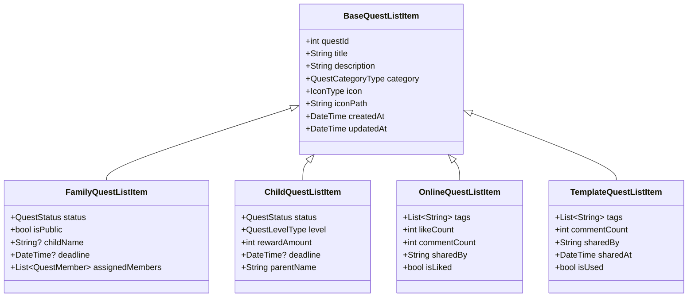

# クエスト一覧画面_QuestListItem

## 目次
- [目次](#目次)
- [クラス図](#クラス図)
- [BaseQuestListItem](#basequestlistitem)
  - [概要](#概要)
  - [メンバ](#メンバ)
  - [用途](#用途)
- [FamilyQuestListItem](#familyquestlistitem)
  - [継承元](#継承元)
  - [追加メンバ](#追加メンバ)
  - [用途](#用途-1)
- [ChildQuestListItem](#childquestlistitem)
  - [継承元](#継承元-1)
  - [追加メンバ](#追加メンバ-1)
  - [用途](#用途-2)
- [OnlineQuestListItem](#onlinequestlistitem)
  - [継承元](#継承元-2)
  - [追加メンバ](#追加メンバ-2)
  - [用途](#用途-3)
- [TemplateQuestListItem](#templatequestlistitem)
  - [継承元](#継承元-3)
  - [追加メンバ](#追加メンバ-3)
  - [用途](#用途-4)

## クラス図

## BaseQuestListItem
### 概要
- クエスト一覧アイテムの基底クラス
- 各画面共通のクエスト情報を保持
- 画面固有の表示情報は継承クラスで追加

### メンバ
- int questId: クエストID
- String title: クエストタイトル
- String description: クエスト説明
- QuestCategoryType category: クエストカテゴリ
- IconType icon: アイコンタイプ
- String iconPath: アイコンパス
- DateTime createdAt: 作成日時
- DateTime updatedAt: 更新日時

### 用途
- 全画面共通のクエスト基本情報
- 基底クラスとして継承利用
- タイトル、説明、カテゴリなどの基本表示項目を提供

## FamilyQuestListItem
### 継承元
- BaseQuestListItem

### 追加メンバ
- bool isPublic: 公開状態。子供メンバーの公開状態を示す
- DateTime? deadline: 期限
- List<QuestMember> assignedMembers: 担当メンバー一覧

### 用途
- 家族画面専用のクエスト表示情報
- ステータス表示（公開中、進行中、クリア、報告中、未公開）
- 担当メンバーのアイコン表示
- 期限の表示

## ChildQuestListItem
### 継承元
- BaseQuestListItem

### 追加メンバ
- QuestStatus status: クエストステータス
- QuestLevelType level: 難易度レベル
- int rewardAmount: 報酬金額
- DateTime? deadline: 期限
- String parentName: 作成者（親）名

### 用途
- 子供画面専用のクエスト表示情報
- レベル表示（星1〜5）
- 報酬金額の表示
- 作成者（親）の表示

## OnlineQuestListItem
### 継承元
- BaseQuestListItem

### 追加メンバ
- List<String> tags: タグ一覧
- int likeCount: いいね数
- int commentCount: コメント数
- String sharedBy: 共有者名
- bool isLiked: 自分がいいねしているか

### 用途
- オンライン画面専用のクエスト表示情報
- いいね数・コメント数の表示
- タグ表示
- いいねボタンの状態管理

## TemplateQuestListItem
### 継承元
- BaseQuestListItem

### 追加メンバ
- List<String> tags: タグ一覧
- int commentCount: コメント数
- String sharedBy: 共有者名
- DateTime sharedAt: 共有日時
- bool isUsed: 使用済みフラグ

### 用途
- テンプレート画面専用のクエスト表示情報
- コメント数の表示
- 共有者と共有日時の表示
- 使用済み状態の管理
