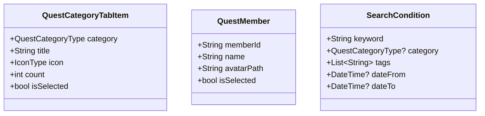

# クエスト一覧画面_その他構造体

## 目次
- [目次](#目次)
- [概要](#概要)
- [クラス図](#クラス図)
- [QuestCategoryTabItem](#questcategorytabitem)
  - [概要](#概要-1)
  - [メンバ](#メンバ)
  - [用途](#用途)
- [QuestMember](#questmember)
  - [概要](#概要-2)
  - [メンバ](#メンバ-1)
  - [用途](#用途-1)
- [SearchCondition](#searchcondition)
  - [概要](#概要-3)
  - [メンバ](#メンバ-2)
  - [用途](#用途-2)

## 概要
このファイルでは、クエスト一覧画面で使用される補助的な構造体を定義します。

フィルター系とリストアイテム系の構造体は、管理しやすさのため以下のファイルに分割されています：
- [QuestFilter系構造体](./QuestListPage_QuestFilter.md)
- [QuestListItem系構造体](./QuestListPage_QuestListItem.md)

## クラス図

## QuestCategoryTabItem
### 概要
- クエストカテゴリタブの表示情報
- タブバーに表示される各カテゴリの情報を保持

### メンバ
- QuestCategoryType category: カテゴリタイプ
- String title: 表示タイトル
- IconType icon: カテゴリアイコン
- int count: そのカテゴリのクエスト数
- bool isSelected: 選択状態

### 用途
- カテゴリタブバーの各タブ表示
- カテゴリ別のクエスト数表示
- 選択状態の管理

## QuestMember
### 概要
- クエストに関連するメンバー情報
- 家族画面でのメンバー表示に使用

### メンバ
- String memberId: メンバーID
- String name: メンバー名
- String avatarPath: アバター画像パス
- bool isSelected: 選択状態（フィルター用）

### 用途
- 家族画面での担当メンバー表示
- メンバーアイコンの表示
- メンバー選択フィルターでの使用

## SearchCondition
### 概要
- 検索条件を保持する構造体
- 詳細検索機能で使用

### メンバ
- String keyword: 検索キーワード
- QuestCategoryType? category: カテゴリフィルター
- List<String> tags: タグフィルター
- DateTime? dateFrom: 期間検索開始日
- DateTime? dateTo: 期間検索終了日

### 用途
- 詳細検索機能での条件保持
- 検索API呼び出し時のパラメータ
- 検索履歴の保存
