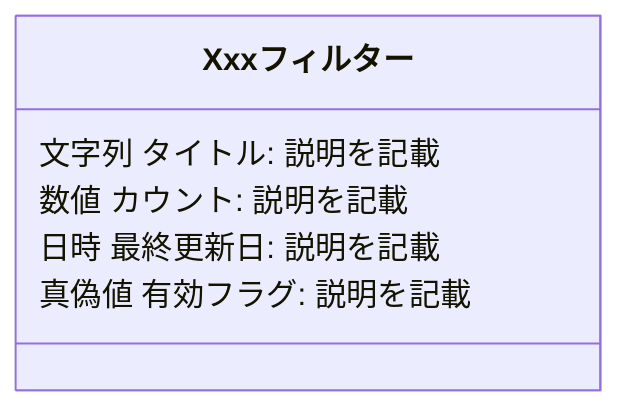
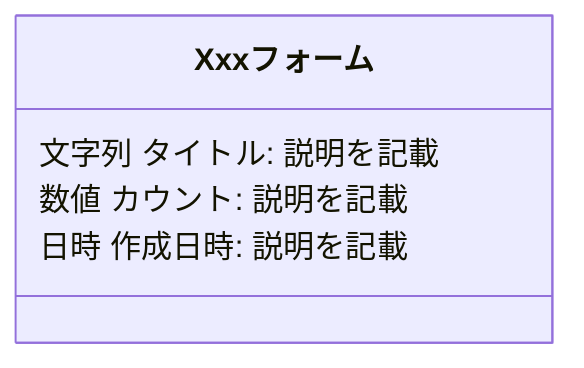
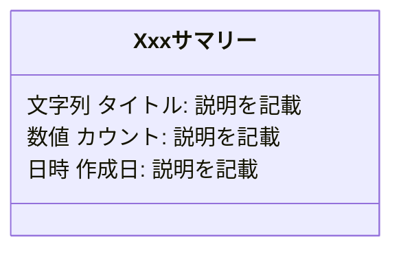

# テンプレート_構造体
## Xxxフィルター

```mermaid
classDiagram
direction LR
class Xxxフィルター {
  文字列 タイトル: 説明を記載
  数値 カウント: 説明を記載
  日時 最終更新日: 説明を記載
  真偽値 有効フラグ: 説明を記載
}
```

## Xxxフォーム

```mermaid
classDiagram
direction LR
class Xxxフォーム {
  文字列 タイトル: 説明を記載
  数値 カウント: 説明を記載
  日時 作成日時: 説明を記載
}
```

## Xxxサマリー

```mermaid
classDiagram
direction LR
class Xxxサマリー {
  文字列 タイトル: 説明を記載
  数値 カウント: 説明を記載
  日時 作成日: 説明を記載
}
```
