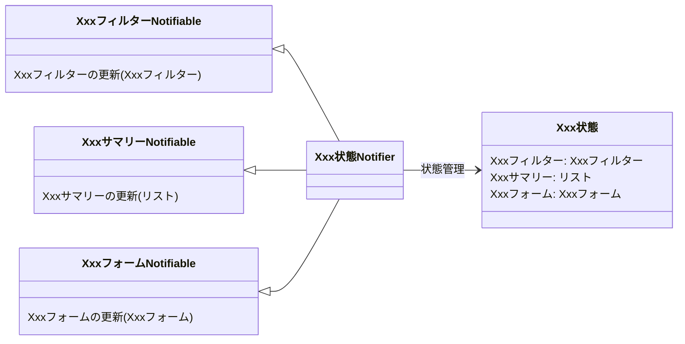

# テンプレート_状態管理

## 目次
- [目次](#目次)
- [Xxx状態](#xxx状態)

## Xxx状態

```mermaid
classDiagram
direction LR
%% 状態
class Xxx状態 {
  Xxxフィルター: Xxxフィルター
  Xxxサマリー: リスト<Xxxサマリー>
  Xxxフォーム: Xxxフォーム
}

%% インターフェース
class XxxフィルターNotifiable {
  Xxxフィルターの更新(Xxxフィルター)
}
class XxxサマリーNotifiable {
  Xxxサマリーの更新(リスト<Xxxサマリー>)
}
class XxxフォームNotifiable {
  Xxxフォームの更新(Xxxフォーム)
}
XxxフィルターNotifiable <|-- Xxx状態Notifier
XxxサマリーNotifiable <|-- Xxx状態Notifier
XxxフォームNotifiable <|-- Xxx状態Notifier
Xxx状態Notifier --> Xxx状態: 状態管理
```
