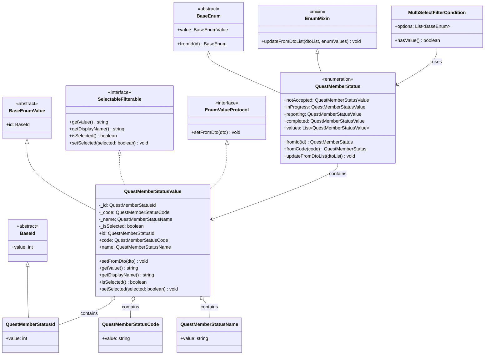

# クエストメンバーのステータス_クラス図

## クラス図



## 使用パターンの説明

### 1. 疑似Enumとしての使用
```dart
// 定数として使用
final status = QuestMemberStatus.inProgress;
print(status.value.getDisplayName()); // "進行中"
```

### 2. フィルター条件での使用
```dart
// 複数選択フィルターで使用
final filter = MultiSelectFilterCondition<QuestMemberStatus>(
  options: QuestMemberStatus.values
);

// 特定のステータスを選択状態にする
QuestMemberStatus.inProgress.value.setSelected(true);
QuestMemberStatus.completed.value.setSelected(true);
```

### 3. DTOからの動的更新
```dart
// API初期化時に値を動的更新
QuestMemberStatus.updateFromDtoList(questMemberStatusDtoList);

// 翻訳された表示名が設定される
print(QuestMemberStatus.inProgress.value.getDisplayName()); // 言語に応じて "進行中" or "In Progress"
```

## 設計のポイント

1. **型安全性**: ジェネリクスとインターフェースによる型安全な実装
2. **拡張性**: 新しいステータスを簡単に追加可能
3. **国際化対応**: DTOから動的に翻訳された表示名を取得
4. **フィルター対応**: SelectableFilterableインターフェースによりフィルター機能を統一
5. **一貫性**: BaseEnum/BaseEnumValueパターンによる統一されたEnum実装
