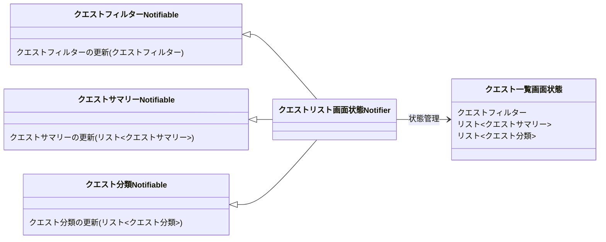

# クエスト一覧画面_状態管理

## 目次
- [目次](#目次)
- [クエスト一覧画面状態](#クエスト一覧画面状態)

## クエスト一覧画面状態

```mermaid
classDiagram
direction LR
%% 状態
class クエスト一覧画面状態 {
  クエストフィルター
  リスト<クエストサマリー>
  リスト<クエスト分類>
}
%% インターフェース
class クエストフィルターNotifiable {
  クエストフィルターの更新(クエストフィルター)
}
class クエストサマリーNotifiable {
  クエストサマリーの更新(リスト<クエストサマリー>)
}
class クエスト分類Notifiable {
  クエスト分類の更新(リスト<クエスト分類>)
}

クエストフィルターNotifiable <|-- クエストリスト画面状態Notifier
クエストサマリーNotifiable <|-- クエストリスト画面状態Notifier
クエスト分類Notifiable <|-- クエストリスト画面状態Notifier
クエストリスト画面状態Notifier --> クエスト一覧画面状態: 状態管理
```
