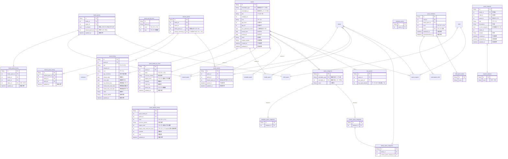

```mermaid
erDiagram

    quests {
        %% quest基盤テーブル。
        %% 
        %% クラステーブル継承の親テーブル。
        %% 最新の更新日時を取得したい場合は、子テーブルの更新日時の最新を取得する。

        String id PK
        %% ---
        String inheritable_type FK "継承先のテーブル名"
        int inheritable_id FK "継承先のレコードのID"
        %% ---
        String title "クエスト名"
        int category_id
        String icon "アイコン"

        int age_from "何歳から"
        int age_till "何歳まで"

        bool has_published_month "公開月設定フラグ"
        date month_from "何月から"
        date month_till "何月まで"

        String client "依頼主"
        String request_details "依頼内容"
        %% ---
        datetime created_at "作成日時"
        datetime updated_at "更新日時"
    }

    quests ||--|{ quest_history: ""

    quest_history {
        %% クエスト基盤の履歴テーブル

        String id PK
        %% ---
        int quest_id FK
        %% ---
        String title "クエスト名"
        int category_id
        String icon "アイコン"

        int age_restriction "受注可能年齢"
        date release_date "掲載日"
        date close_date "掲載終了日"

        bool has_limited_time "期間限定フラグ"
        date limited_time_start_date "期間限定開始日"
        date limited_time_end_date "期間限定終了日"

        String client "依頼主"
        String request_details "依頼内容"
        %% ---
        datetime updated_at "更新日時"
    }

    quests }|--|| quest_details_by_level: ""

    quest_exp_by_level {
        String id
        String quest_id
        %% ---
        int level "クエストレベル"
        int exp "クエスト経験値"
    }

    quest_details_by_level {
        %% レベルごとのクエスト条件テーブル。

        String id PK
        %% ---
        int quest_id FK
        int level "クエストレベル"
        %% ---
        String success_criteria "成功条件"

        int target_count "クエスト達成までの回数"

        int rewards "報酬金"
        int child_exp "経験値"
        int quest_exp "クエスト経験値"
        %% ---
        datetime updated_at "更新日時"
    }

    quest_details_by_level ||--|{ quest_details_history: ""

    quest_details_history {
        %% クエスト詳細の履歴テーブル。

        String id PK
        %% ---
        int quest_details_id FK
        %% ---
        int quest_id FK
        int level "クエストレベル"
        %% ---
        String success_criteria "成功条件"

        int target_count "クエスト達成までの回数"
        int target_count_until_next_level "クエストレベルupに必要な達成回数"

        int rewards "報酬金"
        int exp "経験値"
        %% ---
        datetime updated_at "更新日時"
    }

    quests ||--o| family_quest: "inherits to"
    family ||--o{ family_quest:""

    family_quests {
        %% 家族が作成したクエストテーブル。

        String id PK
        %% ---
        int family_id FK
        int quest_id FK
        %% ---
        bool is_shared "共有したかどうかを示すフラグ"
        int shared_quest_id FK "共有クエストのid"
        %% ---
        datetime updated_at "更新日時"
    }

    family_quests ||--|{ family_quest_history: ""

    family_quest_history {
        %% 家族クエストの履歴テーブル。

        String id PK
        %% ---
        int family_quest_id PK
        %% ---
        int family_id FK
        int quest_id FK
        %% ---
        int status_id FK "ステータス"
        %% ---
        datetime updated_at "更新日時"
    }


    family_quests ||--o| shared_quest: ""


    family }|--|| shared_quest: ""
    quests ||--o| shared_quest: "inherits to"

    shared_quests {
        %% 家族がオンライン上に共有したクエストテーブル。
        %% 
        %% いいね数の確認方法: 
        %%      saved_questsテーブルで自身のid検索を実施する。
        %% 作成元クエストの更新確認方法:
        %%      このshared_questの更新日と比較して更新確認を実施する。

        String id PK
        %% ---
        int family_id FK
        int quest_id FK
        %% ---
        int family_quest_id FK "作成元のクエストID"
        int pinned_comment_id FK "ピン留めされたコメントID"
    }

    shared_quests ||--o{ shared_quest_history: ""

    shared_quest_history {
        %% 家族がオンライン上に共有したクエストテーブルの履歴。

        String id PK
        %% ---
        int shared_quest_id FK
        %% ---
        int family_id FK
        int quest_id FK
        %% ---
        datetime updated_at "更新日時"
    }

    shared_quests ||--o| comment: "pin"

    family }|--o| saved_quests: ""
    quests }|--o| saved_quests: ""

    shared_quests ||--o{ saved_quests: ""

    saved_quests {
        %% 家族が保存(いいね)したクエストテーブル。
        %% 
        %% 作成元クエストの更新確認方法:
        %%      このshared_questの更新日と比較して更新確認を実施する。

        String id PK
        %% ---
        int quest_id FK
        int family_id FK
        %% ---
        int shared_quest_id FK "保存元の共有クエストID"
        %% ---
        datetime saved_at "作成日時"
        datetime updated_at "更新日時"
    }

    quests }|--o| template_quest: "inherits to"

    template_quests {
        %% アプリのテンプレートクエストテーブル。

        String id PK
        %% ---
        int quest_id FK
        %% ---
    }

    quest_members {
        %% メンバーに公開されているクエストのテーブル。
        %% 
        %% メンバーとクエストの中間テーブル。

        String id PK
        %% ---
        int child_id FK
        int family_quest_id FK
        int level "クエストレベル"
        %% ---
        int status FK "クエスト状況"
        %% ---
        datetime published_at "公開日時"
        datetime achievemented_at "達成日時"
    }

    quest_members ||--o{ participated_child: ""

    quest_members }|--|| child_quest_status: ""

    child_quest_status {
        %% 現在のクエスト状況。
        %% 
        %% 例: 未受注、進行中、申請中、達成済み

        String id PK
        %% ---
        String name
    }

    child }|--|| child_quest:""
    family_quests }|--|| child_quest:""


    quests }|--|| quest_categories:""

    quests }|--|| quest_categories: ""

    quest_categories {
        %% クエスト分類テーブルの基盤。
        %% 
        %% クラステーブル継承。

        String id PK
        %% ---
        String inheritable_type FK "継承先のテーブル名"
        int inheritable_id FK "継承先のレコードのID"
        %% ---
        String name "分類名"
    }

    quest_categories ||--o| template_quest_categories: "inherits to"
    quest_categories ||--o| custom_quest_categories: "inherits to"

    template_quest_categories {
        %% テンプレートクエスト分類テーブル。

        String id PK
        %% ---
        int category_id FK
    }

    custom_quest_categories {
        %% 家族が設定したクエスト分類テーブル。
        %% 
        %% [家族-クエスト分類]間は多対多なため、中間テーブルで管理。

        String id PK
        %% ---
        int category_id FK
    }

    family }|--|| family_quest_categories: ""
    custom_quest_categories }|--|| family_quest_categories: ""

    family_quest_categories {
        %% 家族とクエスト分類の中間テーブル。

        String id PK
        %% ---
        int family_id FK
        int custom_quest_category_id FK
    }

    quests }|--|{ key_quests:""

    key_quests {
        %% キークエストテーブル。
        %% 
        %% 子クエストが消えた場合:
        %%     このテーブルからも削除され、条件がクリアになったクエストは解放される。 
        %% 親クエストが消えた場合:
        %%      すべての子クエストとの繋がりが消える。

        String id PK
        %% ---
        int quest_id FK
        int key_quest_id FK
        %% ---
        int key_quest_details "キークエストの必要レベル"
    }

    child ||--o{ quest_request: ""
    family ||--o{ quest_request: ""
    quests ||--o{ quest_request: ""

    quest_requests {
        %% クエストの要望申請。
        %% 
        %% 新規クエストの要望の場合:
        %%  quest_idにNull、is_new_requestにTrue。
        %% 既存クエストに対する要望の場合:
        %%  quest_idに既存クエストID、is_new_requestにFalse。

        String id PK
        %% ---
        int family_id FK "家族ID"
        int child_id FK "依頼人"
        int quest_id FK "既存クエスト"
        %% ---
        String title "タイトル"
        String description "内容"
        bool is_new_requests "新規要望かどうか"
        int status_id FK ""
        String answer "回答"
        %% ---
        datetime created_at "作成日時"
        datetime answered_at "回答日時"
        datetime updated_at "更新日時"
    }

    quest_requests }|--|| request_statuses: ""

    request_statuses {
        %% ウエストの要望申請のステータス。
        %% 
        %% 例: 申請中、否認、承認

        String id PK
        %% ---
        String name "ステータス"
    }


    %% %% penalty基盤テーブル
    %% penalty {
    %%     String id PK
    %%     String inheritable_type FK "継承先のテーブル名" "クラス種別"
    %%     int inheritable_id FK "継承先のレコードのID"
    %%     String name "違反行為名"
    %%     int category_id FK
    %%     String icon "アイコン"
    %%     int age_restriction "掲載開始年齢"
    %%     date release_date "掲載日"
    %%     date close_date "掲載終了日"
    %%     bool has_limited_time "期間限定フラグ"
    %%     date limited_time_start_date "期間限定開始日"
    %%     date limited_time_end_date "期間限定終了日"
        
    %%     String client "依頼主"
    %%     String request_details "依頼内容"
    %% }

    %% penalty }|--|| penalty_level: ""

    %% penalty_level {
    %%     String id PK
    %%     int penalty_id FK
    %%     int level "レベル"

    %%     String penalty_conditions "違反行為の条件"
    %%     int target_count "罰金までの回数"
    %%     int target_count_until_next_level "罰金レベルがupするまでの回数"

    %%     int penalty_amount "罰金額"
    %%     int reduced_exp "経験値"
    %% }

    %% family_penalty {
    %%     String id PK
    %%     int family_id FK
    %%     int penalty_id FK
    %%     int shared_penalty_id FK
    %% }

    %% family_penalty ||--|| family_penalty_statuses: ""

    %% %% ペナルティステータス(公開or非公開)
    %% family_penalty_statuses {
    %%     String id PK
    %%     String name "ステータス名"
    %% }

    %% family_penalty ||--o| shared_penalty: ""
    
    %% family ||--|{ family_penalty:""
    %% penalty ||--o| family_penalty: "inherits to"

    %% family ||--|{ saved_penalty:""
    %% penalty ||--o| saved_penalty: "inherits to"

    %% %% 家族が保持しているテンプレートクエスト
    %% saved_penalty {
    %%     String id PK
    %%     String inheritable_type FK "継承先のテーブル名"
    %%     int inheritable_id FK "継承先のレコードのID"
    %%     int family_id FK
    %% }

    %% saved_penalty ||--o| shared_penalty: "inherits to"
    %% family }|--|| shared_penalty: ""

    %% %% 家族がオンライン上に共有したクエスト
    %% shared_penalty {
    %%     String id PK
    %%     int family_id FK
    %%     int penalty_id FK
    %%     int family_penalty_id FK
    %% }

    %% saved_penalty ||--o| template_penalty: "inherits to"

    %% %%      アプリのデフォルトテンプレート
    %% %%      いいねした共有クエスト
    %% template_penalty {
    %%     String id PK
    %%     int penalty_id FK
    %% }


    %% child_penalty {
    %%     String id PK
    %%     int child_id FK
    %%     int family_penalty_id FK
    %% }

    %% child ||--|{ child_penalty:""
    %% family_penalty ||--|{ child_penalty:""


    %% penalty }|--|| penalty_categories:""

    %% penalty }|--|| penalty_categories: ""


    %% %% テンプレ分類とカスタム分類は分けることにした。
    %% %% テンプレ分類の読み込みが早くなる
    %% %% 一つのテーブルだと負荷が集中するため
    %% penalty_categories {
    %%     String id PK
    %%     String inheritable_type FK "継承先のテーブル名"
    %%     int inheritable_id FK "継承先のレコードのID"
    %%     String name "分類名"
    %% }

    %% penalty_categories ||--o| template_penalty_categories: "inherits to"
    %% penalty_categories ||--o| custom_penalty_categories: "inherits to"

    %% template_penalty_categories {
    %%     String id PK
    %%     int category_id FK
    %% }

    %% custom_penalty_categories {
    %%     String id PK
    %%     int category_id FK
    %%     int family_id FK
    %% }

    %% family }|--|| family_penalty_categories: ""
    %% custom_penalty_categories }|--|| family_penalty_categories: ""

    %% family_penalty_categories {
    %%     String id PK
    %%     int family_id FK
    %%     int category_id FK
    %% }
```
