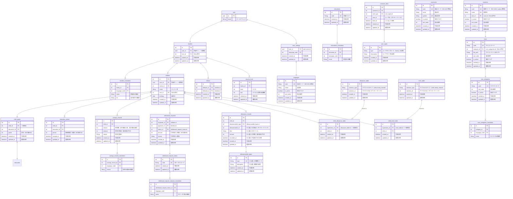

```mermaid
erDiagram
    user {
        %% supabase認証テーブル
        uuid id PK
        String email "メールアドレス"
    }

    user ||--|| families: ""

    families {
        %% 家族テーブル
        int id PK
        uuid user_id FK "外部キー、一意制約"
        int icon_id FK "NULL許可"
        datetime created_at "作成日時"
        datetime updated_at "更新日時"
    }

    families ||--|{ families_translation: ""

    families_translation {
        int id PK
        int family_id FK
        int language_code FK
        String name "家族名の翻訳"
        String bio "自己紹介の翻訳"
    }    families ||--|{ children: ""

    children {
        %% メンバー(子供ユーザ)
        int id PK
        uuid user_id FK "外部キー、一意制約"
        int family_id FK
        String name "メンバー名"
        int icon_id FK "NULL許可"
        date birthday "誕生日"
        datetime created_at "作成日時"
        datetime updated_at "更新日時"
    }

    children ||--|| child_grade: ""
    child_grade ||--|| education: ""

    child_grade {
        %% メンバーの現在の学年や職業
        int id PK
        int child_id FK "一意制約"
        int education_id FK
        int grade "学年（正の値のみ）"
        datetime created_at "作成日時"
        datetime updated_at "更新日時"
    }

    educations {
        %% 学歴マスタテーブル
        int id PK
        String code UK "学歴コード"
        datetime created_at "作成日時"
        datetime updated_at "更新日時"
    }

    educations ||--|{ educations_translation: ""

    educations_translation {
        int id PK
        int education_id FK
        int language_code FK
        String name "学歴名の翻訳"
    }

    children ||--|{ education_period: ""

    education_period {
        %% メンバーの教育期間
        int id PK
        int child_id FK
        int education_id FK
        int period "教育期間（年数、正の値のみ）"
        datetime created_at "作成日時"
        datetime updated_at "更新日時"
    }    children ||--|{ savings_records: ""

    savings_records {
        %% 貯金記録の履歴
        int id PK
        int child_id FK
        int amount "貯金額（正の値は入金、負の値は出金）"
        int balance "貯金の残高（負の値は不可）"
        String reason "貯金の理由"
        datetime created_at "作成日時"
        datetime updated_at "更新日時"
    }

    savings_records ||--|{ savings_records_translation: ""

    savings_records_translation {
        int id PK
        int savings_record_id FK
        int language_code FK
        String reason "貯金の理由の翻訳"
    }

    children ||--|{ withdrawal_requests: ""

    withdrawal_requests {
        %% 引き落とし申請テーブル
        int id PK
        int requester_id FK "children.id"
        int approver_id FK "families.id"
        int status_id FK "withdrawal_request_status.id"
        int amount "引き落とし金額（正の値のみ）"
        String reason "引き落とし理由"
        datetime created_at "作成日時"
        datetime updated_at "更新日時"
    }

    withdrawal_requests ||--|| withdrawal_request_status: ""

    withdrawal_request_status {
        %% 引き落とし申請ステータス
        int id PK
        String code UK "ステータスコード"
        datetime created_at "作成日時"
        datetime updated_at "更新日時"
    }

    withdrawal_request_status ||--|{ withdrawal_request_statuses_translation: ""

    withdrawal_request_statuses_translation {
        int id PK
        int withdrawal_request_status_id FK
        int language_code FK
        String name "ステータス名の翻訳"
    }    families ||--|{ follows: ""

    follows {
        %% フォロー関係テーブル
        int id PK
        int follower_id FK "families.id"
        int followed_id FK "families.id"
        datetime created_at "作成日時"
        datetime updated_at "更新日時"
    }

    families ||--|{ exp_by_level: ""

    exp_by_level {
        %% 親が子供の経験値とレベルの関係を定義
        int id PK
        int family_id FK
        int level "レベル"
        int exp "レベルに必要な経験値"
        datetime created_at "作成日時"
        datetime updated_at "更新日時"
    }

    user ||--|| user_settings: ""

    user_settings {
        %% ユーザの基本設定
        uuid user_id PK "auth.users.id"
        int language_code FK
        datetime created_at "作成日時"
        datetime updated_at "更新日時"
    }

    user_settings ||--|| languages: ""

    languages {
        %% 言語マスタテーブル
        int id PK
        String code UK "言語コード（ISO 639-1準拠）"
        String name "言語名"
        boolean is_active "有効フラグ"
        int sort_order "表示順序"
        datetime created_at "作成日時"
        datetime updated_at "更新日時"
    }

    children ||--|{ allowance_records: ""

    allowance_records {
        %% お小遣いの記録テーブル
        int id PK
        int child_id FK
        int allowanceable_type FK "allowanceable_types.id"
        int allowanceable_id "お小遣いの対象ID（ポリモーフィック）"
        String title "お小遣いのタイトル"
        int amount "お小遣いの金額（負の値は不可）"
        datetime recorded_at "お小遣いが記録された日時"
        datetime created_at "作成日時"
        datetime updated_at "更新日時"
    }

    allowance_records ||--|| allowanceable_types: ""

    allowanceable_types {
        %% お小遣いの種類を管理
        int id PK
        String type UK "お小遣いの種類コード"
        String description "お小遣い種類の説明"
        datetime created_at "作成日時"
        datetime updated_at "更新日時"
    }    allowance_table {
        %% お小遣い設定の基底テーブル（ポリモーフィック関連）
        int id PK
        String subclass_type "サブクラスタイプ（child, family, shared）"
        int subclass_id "サブクラスID（ポリモーフィック）"
        datetime created_at "作成日時"
        datetime updated_at "更新日時"
    }

    allowance_table ||--o| child_allowance_table: "inherits to"
    children ||--|| child_allowance_table: ""

    child_allowance_table {
        %% メンバー個人のお小遣い設定テーブル
        int id PK
        int superclass_id FK "allowance_table.id（一意制約）"
        int child_id FK
        datetime created_at "作成日時"
        datetime updated_at "更新日時"
    }

    level_table {
        %% レベル設定の基底テーブル（ポリモーフィック関連）
        int id PK
        String subclass_type "サブクラスタイプ（child, family, shared）"
        int subclass_id "サブクラスID（ポリモーフィック）"
        datetime created_at "作成日時"
        datetime updated_at "更新日時"
    }

    level_table ||--o| child_level_table: "inherits to"
    children ||--|| child_level_table: ""

    child_level_table {
        %% メンバー個人のレベル設定テーブル
        int id PK
        int superclass_id FK "level_table.id（一意制約）"
        int child_id FK
        datetime created_at "作成日時"
        datetime updated_at "更新日時"
    }

    user_types {
        %% ユーザのタイプを分類するテーブル
        int id PK
        String type UK "ユーザタイプコード（family, child等）"
        String description "ユーザタイプの説明"
        datetime created_at "作成日時"
        datetime updated_at "更新日時"
    }

    comment_likes {
        %% コメントへのいいね
        int id PK
        int comment_id FK
        int user_type FK "user_types.id"
        int user_id "ユーザID（ポリモーフィック）"
        datetime liked_at "いいねした日時"
        datetime created_at "作成日時"
        datetime updated_at "更新日時"
    }

    comment_likes ||--|| user_types: ""

    icons {
        %% アイコン情報
        int id PK
        String code UK "アイコンコード"
        int category_id FK "icon_categories.id（NULL許可）"
        String file_path "アイコンファイルのパス"
        int sort_order "表示順序"
        boolean is_active "有効フラグ"
        datetime created_at "作成日時"
        datetime updated_at "更新日時"
    }

    icons ||--|| icon_categories: ""

    icon_categories {
        %% アイコンのカテゴリ
        int id PK
        String code UK "カテゴリコード"
        int sort_order "表示順序"
        boolean is_active "有効フラグ"
        datetime created_at "作成日時"
        datetime updated_at "更新日時"
    }

    icon_categories ||--|{ icon_categories_translation: ""

    icon_categories_translation {
        int id PK
        int category_id FK
        int language_code FK
        String name "カテゴリ名の翻訳"
    }

    currencies {
        %% 通貨情報を管理するマスタテーブル
        int id PK
        String code UK "通貨コード（ISO 4217準拠）"
        String name "通貨名"
        String symbol UK "通貨記号"
        boolean is_active "有効フラグ"
        int sort_order "表示順序"
        datetime created_at "作成日時"
        datetime updated_at "更新日時"
    }

    countries {
        %% 国家情報を管理するマスタテーブル
        int id PK
        String code UK "国家コード（ISO 3166-1 alpha-3準拠）"
        String name UK "国家名"
        int icon_id FK "icons.id（NULL許可）"
        boolean is_active "有効フラグ"
        int sort_order "表示順序"
        datetime created_at "作成日時"
        datetime updated_at "更新日時"
    }

    countries ||--|| icons: ""
```
