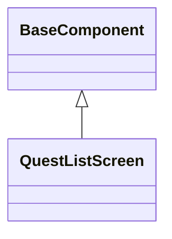

# クエスト一覧画面_コンポーネント

## 目次

## クエスト一覧スクリーン
### クラス図

### 概要
- クエスト分類タブは、クエスト一覧画面の上部に配置され、クエストを分類するためのタブバー
- クエスト分類Entityから取得した情報をセットする
- 対応するタブバービューには、指定された分類のクエストが表示される

### コンストラクタ
- 引数1: `QuestCategories`
  - クエスト分類のリスト
- 引数2: `BaseQuestListItem`
  - クエスト一覧のアイテムウィジェット
- 引数3: `QuestFilterNotifiable`
  - クエストフィルターの更新を通知するためのインターフェース

### render()
- クエスト分類タブバーを表示する
- クエストリストを表示する
- 受け取ったクエストリストアイテムを表示する

### クエストカテゴリタブ押下時
- QuestFilterNotifiable.updateQuestCategory(QuestCategory)
  - 選択されたクエストカテゴリを更新する
  - [クエスト一覧画面_状態管理](QuestListPage_状態管理.md)を参照
