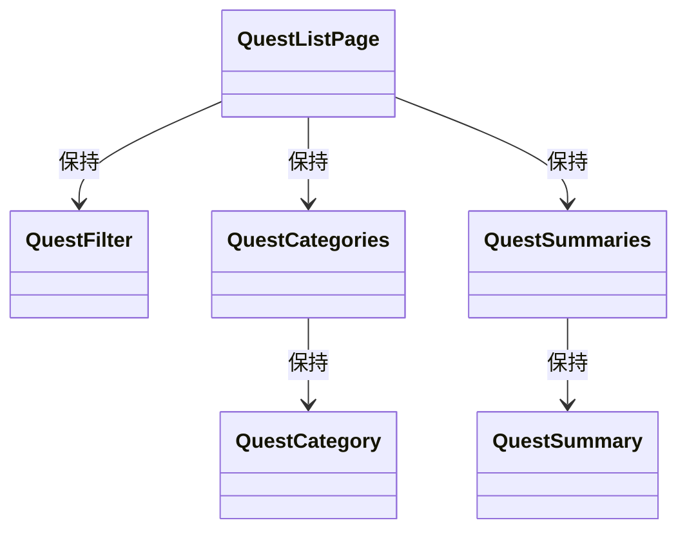

# {画面名} 構造体

## 目次

## クラス図

```mermaid
classDiagram
%% 構造体
class QuestFilter
class QuestCategories
class QuestCategory
class QuestSummaries
class QuestSummary

QuestListPage --> QuestFilter : 保持
QuestListPage --> QuestCategories : 保持
QuestListPage --> QuestSummaries : 保持

QuestCategories --> QuestCategory : 保持
QuestSummaries --> QuestSummary : 保持
```

// 以下から構造体の例を記載します。
## XxxForm
### メンバ
- [値オブジェクトA](値オブジェクトA.md)
- 値オブジェクトB

## XxxFilter
### メンバ
- 値オブジェクトC

## XxxSummaries
### メンバ
- 値オブジェクトD
