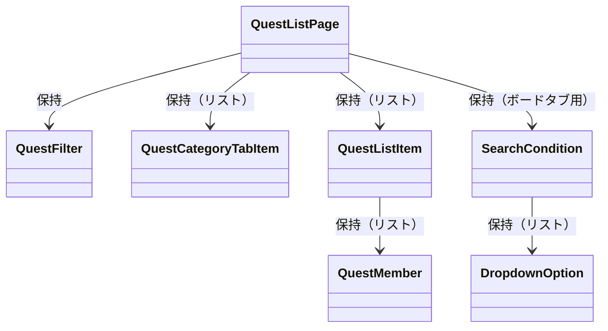

# クエスト一覧画面 構造体

## 目次
- [目次](#目次)
- [クラス図](#クラス図)
- [QuestFilter](#questfilter)
  - [メンバ](#メンバ)
  - [用途](#用途)
- [QuestCategoryTabItem](#questcategorytabitem)
  - [メンバ](#メンバ-1)
  - [用途](#用途-1)
- [QuestListItem](#questlistitem)
  - [メンバ](#メンバ-2)
  - [用途](#用途-2)
- [QuestMember](#questmember)
  - [メンバ](#メンバ-3)
  - [用途](#用途-3)
- [SearchCondition](#searchcondition)
  - [メンバ](#メンバ-4)
  - [用途](#用途-4)

## クラス図 

## QuestFilter
### 概要

### メンバ
- QuestCategoryType selectedCategory: 選択中のカテゴリ
- String searchText: 検索テキスト
- QuestStatus? filterByStatus: ステータスフィルター（オプション）

### 用途
- クエスト一覧の絞り込み条件を管理
- タブ切り替えや検索機能で使用

## QuestCategoryTabItem
### メンバ
- QuestCategoryType category: カテゴリ
- String displayName: 表示名
- int count: 該当クエスト数
- bool isSelected: 選択状態

### 用途
- トップタブバーのカテゴリタブ表示用
- タブごとのクエスト数も表示

## QuestListItem
### メンバ
- int questId: クエストID
- IconType icon: クエストアイコン
- [QuestTitle](../Quest_値オブジェクト.md#questtitle) title: クエストタイトル
- [QuestReward](../Quest_値オブジェクト.md#questreward) reward: 報酬額
- QuestStatus? status: ステータス（家族・子供画面用）
- QuestLevelType? level: レベル（子供画面用）
- bool isPublic: 公開フラグ
- bool isOnlinePublic: オンライン公開フラグ
- List<QuestMember>? membersAssignedTo: 担当メンバーリスト（家族・オンライン画面用）
- String? sharedBy: テンプレート共有者名（テンプレート・オンライン画面用）
- int? commentCount: コメント数（テンプレート・オンライン画面用）
- int? likeCount: いいね数（テンプレート・オンライン画面用）

### 用途
- 各画面のクエストリストアイテム表示用
- 画面タイプに応じて必要な項目のみ設定

## QuestMember
### メンバ
- int memberId: メンバーID
- String memberName: メンバー名
- IconType assignedIcon: 割り当てられたアイコン
- FamilyMemberType memberType: メンバータイプ（親、子供など）
- DateTime? assignedAt: 担当開始日時

### 用途
- クエストメンバー情報の表示用
- クエスト参加可能メンバーの管理
- 今後の拡張（ID、担当日時など）に対応

## SearchCondition
### メンバ
- String selectedConditionKey: 選択中の検索条件キー
- List<[DropdownOption](../../core/共通構造体.md#dropdownoption)> availableConditions: 利用可能な検索条件リスト

### 用途
- ボードタブクエスト画面の検索条件管理
- ドロップダウンの選択状態とオプションリストを保持
