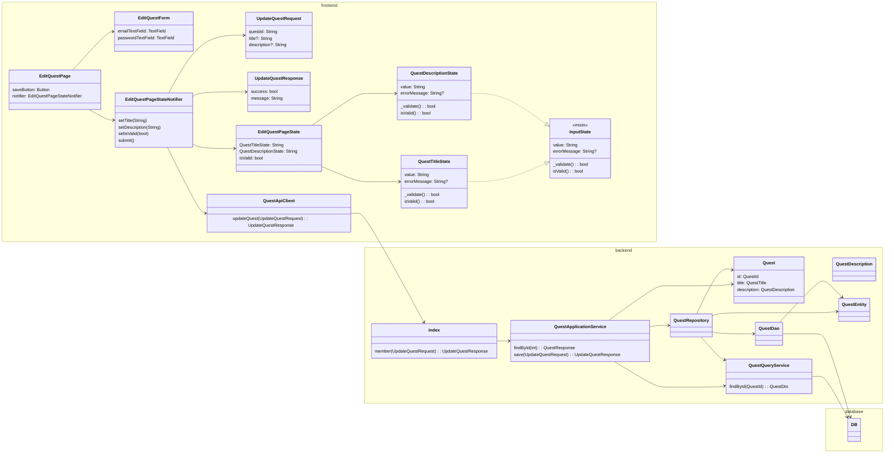

```mermaid
classDiagram
    direction LR
    namespace frontend {
        class EditQuestPage {
            saveButton: Button
            notifier: EditQuestPageStateNotifier
        }
        class EditQuestForm {
            emailTextField: TextField
            passwordTextField: TextField
        }
        class EditQuestPageStateNotifier {
            setTitle(String)
            setDescription(String)
            setIsValid(bool)
            submit()
        }
        class UpdateQuestRequest {
            questId: String
            title?: String
            description?: String
        }
        class UpdateQuestResponse {
            success: bool
            message: String
        }

        class QuestApiClient {
            updateQuest(UpdateQuestRequest): UpdateQuestResponse
        }
        
        class EditQuestPageState {
            QuestTitleState: String
            QuestDescriptionState: String
            isValid: bool
        }

        class InputState {
            <<mixin>>
            value: String
            errorMessage: String?
            _validate(): bool
            isValid(): bool
        }

        class QuestTitleState {
            value: String
            errorMessage: String?
            _validate(): bool
            isValid(): bool
        }
        class QuestDescriptionState {
            value: String
            errorMessage: String?
            _validate(): bool
            isValid(): bool
        }
    }

    namespace backend {
        class index {
            member(UpdateQuestRequest): UpdateQuestResponse
        }

        class Quest {
            id: QuestId
            title: QuestTitle
            description: QuestDescription
        }
        class QuestDescription
        class QuestApplicationService {
            findById(int): QuestResponse
            save(UpdateQuestRequest): UpdateQuestResponse
        }
        class QuestQueryService {
            findById(QuestId): QuestDto
        }
        class QuestRepository
        class QuestDao
        class QuestEntity
    }

    namespace database {
        class DB
    }


    EditQuestPage --> EditQuestPageStateNotifier
    EditQuestPage --> EditQuestForm
    EditQuestPageStateNotifier --> EditQuestPageState
    EditQuestPageState --> QuestTitleState
    EditQuestPageState --> QuestDescriptionState

    QuestTitleState ..|> InputState
    QuestDescriptionState ..|> InputState
    
    EditQuestPageStateNotifier --> UpdateQuestRequest
    EditQuestPageStateNotifier --> UpdateQuestResponse
    EditQuestPageStateNotifier --> QuestApiClient
    
    QuestApiClient --> index
    index --> QuestApplicationService

    QuestApplicationService --> QuestQueryService
    QuestApplicationService --> QuestRepository
    QuestApplicationService --> Quest
    QuestQueryService --> DB
    QuestRepository --> Quest
    QuestRepository --> QuestDao
    QuestRepository --> QuestEntity
    QuestRepository --> QuestQueryService
    QuestDao --> QuestEntity
    QuestDao --> DB
```
