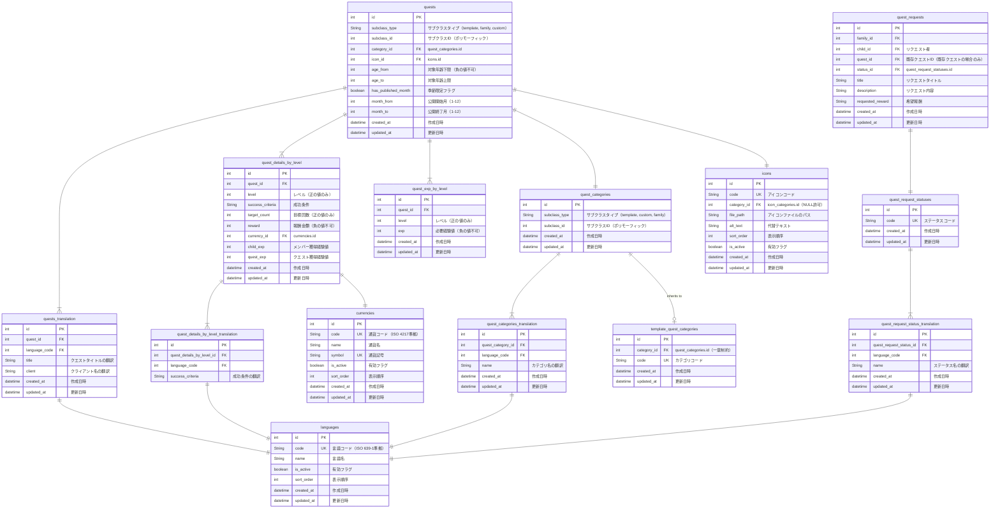

```mermaid
erDiagram

    quests {
        %% クエストの基本情報
        int id PK
        String subclass_type "サブクラスタイプ（template, family, custom）"
        int subclass_id "サブクラスID（ポリモーフィック）"
        int category_id FK "quest_categories.id"
        int icon_id FK "icons.id"
        int age_from "対象年齢下限（負の値不可）"
        int age_to "対象年齢上限"
        boolean has_published_month "季節限定フラグ"
        int month_from "公開開始月（1-12）"
        int month_to "公開終了月（1-12）"
        datetime created_at "作成日時"
        datetime updated_at "更新日時"
    }

    quests ||--|{ quests_translation: ""

    quests_translation {
        int id PK
        int quest_id FK
        int language_code FK
        String title "クエストタイトルの翻訳"
        String client "クライアント名の翻訳"
        datetime created_at "作成日時"
        datetime updated_at "更新日時"
    }

    quests ||--|{ quest_details_by_level: ""

    quest_details_by_level {
        %% レベル別クエスト詳細
        int id PK
        int quest_id FK
        int level "レベル（正の値のみ）"
        String success_criteria "成功条件"
        int target_count "目標回数（正の値のみ）"
        int reward "報酬金額（負の値不可）"
        int currency_id FK "currencies.id"
        int child_exp "メンバー獲得経験値"
        int quest_exp "クエスト獲得経験値"
        datetime created_at "作成日時"
        datetime updated_at "更新日時"
    }

    quest_details_by_level ||--|{ quest_details_by_level_translation: ""

    quest_details_by_level_translation {
        int id PK
        int quest_details_by_level_id FK
        int language_code FK
        String success_criteria "成功条件の翻訳"
    }

    quests ||--|{ quest_exp_by_level: ""

    quest_exp_by_level {
        %% クエストのレベル別必要経験値
        int id PK
        int quest_id FK
        int level "レベル（正の値のみ）"
        int exp "必要経験値（負の値不可）"
        datetime created_at "作成日時"
        datetime updated_at "更新日時"
    }

    quests ||--|| quest_categories: ""

    quest_categories {
        %% クエストカテゴリの基底テーブル
        int id PK
        String subclass_type "サブクラスタイプ（template, custom, family）"
        int subclass_id "サブクラスID（ポリモーフィック）"
        datetime created_at "作成日時"
        datetime updated_at "更新日時"
    }

    quest_categories ||--|{ quest_categories_translation: ""

    quest_categories_translation {
        int id PK
        int quest_category_id FK
        int language_code FK
        String name "カテゴリ名の翻訳"
        datetime created_at "作成日時"
        datetime updated_at "更新日時"
    }

    quest_categories ||--o| template_quest_categories: "inherits to"

    template_quest_categories {
        %% アプリ提供のテンプレートクエストカテゴリ
        int id PK
        int category_id FK "quest_categories.id（一意制約）"
        String code UK "カテゴリコード"
        datetime created_at "作成日時"
        datetime updated_at "更新日時"
    }

    quest_requests {
        %% メンバーからのクエストリクエスト
        int id PK
        int family_id FK
        int child_id FK "リクエスト者"
        int quest_id FK "既存クエストID（既存クエストの場合のみ）"
        int status_id FK "quest_request_statuses.id"
        String title "リクエストタイトル"
        String description "リクエスト内容"
        String requested_reward "希望報酬"
        datetime created_at "作成日時"
        datetime updated_at "更新日時"
    }

    quest_requests ||--|| quest_request_statuses: ""

    quest_request_statuses {
        %% クエストリクエストの状態
        int id PK
        String code UK "ステータスコード"
        datetime created_at "作成日時"
        datetime updated_at "更新日時"
    }

    quest_request_statuses ||--|{ quest_request_status_translation: ""

    quest_request_status_translation {
        int id PK
        int quest_request_status_id FK
        int language_code FK
        String name "ステータス名の翻訳"
        datetime created_at "作成日時"
        datetime updated_at "更新日時"
    }

    currencies {
        %% 通貨情報
        int id PK
        String code UK "通貨コード（ISO 4217準拠）"
        String name "通貨名"
        String symbol UK "通貨記号"
        boolean is_active "有効フラグ"
        int sort_order "表示順序"
        datetime created_at "作成日時"
        datetime updated_at "更新日時"
    }

    quest_details_by_level ||--|| currencies: ""

    languages {
        %% 言語マスタテーブル
        int id PK
        String code UK "言語コード（ISO 639-1準拠）"
        String name "言語名"
        boolean is_active "有効フラグ"
        int sort_order "表示順序"
        datetime created_at "作成日時"
        datetime updated_at "更新日時"
    }

    quests_translation ||--|| languages: ""
    quest_categories_translation ||--|| languages: ""
    quest_request_status_translation ||--|| languages: ""
    quest_details_by_level_translation ||--|| languages: ""

    icons {
        %% アイコン情報
        int id PK
        String code UK "アイコンコード"
        int category_id FK "icon_categories.id（NULL許可）"
        String file_path "アイコンファイルのパス"
        String alt_text "代替テキスト"
        int sort_order "表示順序"
        boolean is_active "有効フラグ"
        datetime created_at "作成日時"
        datetime updated_at "更新日時"
    }

    quests ||--|| icons: ""
```
