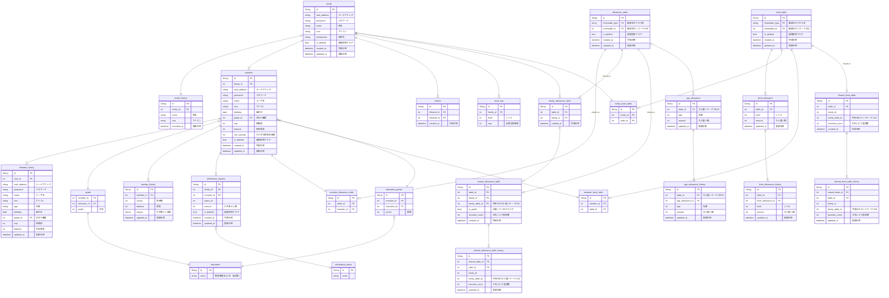

```mermaid

erDiagram
    family {
        %% 家族テーブル。
        %% 
        %% 最新の家族情報を保持。

        String id PK
        %% ---
        string mail_address "メールアドレス"
        string password "パスワード"
        %% ---
        string name "家名"
        string icon "アイコン"
        string introduction "説明文"
        %% ---
        bool is_deleted "論理削除フラグ"
        datetime created_at "作成日時"
        datetime updated_at "更新日時"
    }

    family }|--|| family_history: ""
    
    family_history {
        %% 家族テーブルの履歴。

        String id PK
        %% ---
        int family_id FK
        %% ---
        string name "家名"
        string icon "アイコン"
        %% ---
        datetime recorded_at "更新日時"
    }

    family ||--|{ member: ""

    member {
        %% メンバー。(子供ユーザ)
        %% 
        %% 最新のユーザ情報を保持。

        String id PK
        %% ---
        int family_id FK
        %% ---
        string mail_address "メールアドレス"
        string password "パスワード"
        string name "ユーザ名"
        string icon "アイコン"
        date birthday "誕生日"
        int grade_id FK "学年や職業"
        int exp "経験値"
        int balance "貯金残高"
        int min_savings "ひと月の最低貯金額"
        %% ---
        bool is_deleted "論理削除フラグ"
        datetime created_at "作成日時"
        datetime updated_at "更新日時"
    }

    member ||--|{ member_history: ""

    member_history {
        %% userテーブルの履歴

        String id PK
        %% ---
        int user_id FK
        %% ---
        string mail_address "メールアドレス"
        string password "パスワード"
        string name "ユーザ名"
        string icon "アイコン"
        string age "年齢"
        date birthday "誕生日"
        int grade_id FK "学年や職業"
        int exp "経験値"
        int balance "貯金残高"
        %% ---
       datetime updated_at "更新日時"
    }

    member }|--|| grade: ""
    grade ||--|| education: ""

    grade {
        %% ユーザの現在の学歴・職業。
        %% 
        %% 例: 小学1年~大学4年 社会人 母親 父親など。
        int member_id PK
        %% ---
        int education_id FK
        int grade "学年"
    }
    
    member ||--|{ savings_history: ""

    savings_history {
        %% 貯金額の履歴
        
        String id PK
        %% ---
        int member_id FK
        %% ---
        int saving "貯金額"
        int balance "残高"
        String reason "引き落とし理由"
        %% ---
        datetime updated_at "更新日時"
    }


    member ||--|{ withdrawal_request: ""

    withdrawal_request {
        %% 引き落とし申請フォーム。

        String id PK
        %% ---
        int family_id FK
        int member_id FK
        %% ---
        int status_id
        int amount "引き落とし額"
        %% ---
        bool is_deleted "論理削除フラグ"
        datetime created_at "作成日時"
        datetime updated_at "更新日時"
    }

    withdrawal_request }|--|| withdrawal_status: ""

    withdrawal_status {
        %% 引き落とし申請のステータス。
        %% 
        %% 例: 申請中、承認、却下

        String id PK
        %% ---
        string name
    }

    family ||--|{ follows:""

    follows {
        %% フォローフォロワーを関連づけたテーブル。

        String id PK
        %% ---
        int follower_id FK
        int followee_id FK
        %% ---
        datetime created_at "作成日時"
    }

    family ||--|{ level_exp: ""

    level_exp {
        String id PK
        %% ---
        int family_id FK
        %% ---
        int level "レベル"
        int exp "必要な経験値"
    }

    allowance_table {
        %% お小遣いテーブル。

        String id PK
        %% ---
        string inheritable_type FK "継承先のクラス名"
        int inheritable_id FK "継承先のレコードのID"
        %% ---
        bool is_deleted "論理削除フラグ"
        datetime created_at "作成日時"
        datetime updated_at "更新日時"
    }

    allowance_table ||--o| member_allowance_table: "inherits to"
    member ||--|| member_allowance_table: ""

    member_allowance_table {
        %% メンバーのお小遣いテーブル。

        String id PK
        %% ---
        int table_id FK
        int member_id FK
    }

    allowance_table ||--o| family_allowance_table: "inherits to"
    family ||--|{ family_allowance_table: ""

    family_allowance_table {
        %% お小遣いテーブルのテンプレート。

        String id PK
        %% ---
        int table_id FK
        int family_id FK
        %% ---
        datetime created_at "作成日時"
    }

    allowance_table ||--o| shared_allowance_table: "inherits to"
    family_allowance_table ||--o| shared_allowance_table: ""

    shared_allowance_table {
        %% 公開されたお小遣いテーブル。

        String id PK
        %% ---
        int table_id FK
        int family_id FK
        %% ---
        int family_table_id FK "共有元のお小遣いテーブルID"
        bool is_public "公開しているかどうか"
        %% ---
        int favorites_count "お気に入り登録数"
        %% ---
        datetime created_at "作成日時"
    }

    shared_allowance_table ||--|{ shared_allowance_table_history: ""

    shared_allowance_table_history {
        %% 公開されたお小遣いテーブルの履歴。

        String id PK
        %% ---
        int shared_table_id FK
        %% ---
        int table_id FK
        int family_id
        %% ---
        int family_table_id "共有元のお小遣いテーブルID"
        %% ---
        int favorites_count "お気に入り登録数"
        %% ---
        datetime updated_at "更新日時"
    }

    allowance_table ||--|{ age_allowance: ""

    age_allowance {
        %% 年齢ごとのお小遣い額。

        String id PK
        %% ---
        int table_id FK "お小遣いテーブルのID"
        %% ---
        int age "年齢"
        int amount "お小遣い額"
        %% ---
        datetime updated_at "更新日時"
    }

    age_allowance ||--|{ age_allowance_history: ""

    age_allowance_history {
        %% 年齢ごとのお小遣い額の履歴。

        String id PK
        %% ---
        int table_id FK "お小遣いテーブルのID"
        %% ---
        int age_allowance_id FK
        %% ---
        int age "年齢"
        int amount "お小遣い額"
        %% ---
        datetime updated_at "更新日時"
    }

    family ||--|| family_level_table: ""

    level_table {
        %% ランクごとのお小遣い額。

        String id PK
        %% ---
        string inheritable_type FK "継承先のクラス名"
        int inheritable_id FK "継承先のレコードのID"
        %% ---
        bool is_deleted "論理削除フラグ"
        datetime created_at "作成日時"
        datetime updated_at "更新日時"
    }

    level_table ||--|{ level_allowance: ""

    level_allowance {
        %% ランクごとの報酬

        String id PK
        %% ---
        int table_id FK
        %% ---
        int level "レベル"
        int amount "お小遣い額"
        %% ---
        datetime updated_at "更新日時"
    }

    level_allowance ||--|{ level_allowance_history: ""

    level_allowance_history {
        %% ランクごとの報酬の履歴。

        String id PK
        %% ---
        int table_id FK
        %% ---
        int level_allowance_id FK
        %% ---
        int level "レベル"
        int amount "お小遣い額"
        %% ---
        datetime updated_at "更新日時"
    }

    level_table ||--o| family_level_table: ""
    level_table ||--o| member_level_table: ""

    family_level_table {
        %% テンプレートランクテーブル。

        String id PK
        %% ---
        int family_id FK
        int table_id FK
    }

    member }o--|| member_level_table: ""

    member_level_table {
        %% メンバーのランクテーブル。

        String id PK
        %% ---
        int member_id FK
        int table_id FK
    }

    level_table ||--o| shared_level_table: "inherits to"

    shared_level_table {
        %% 公開されたランクテーブル。

        String id PK
        %% ---
        int table_id FK
        int family_id
        %% ---
        int family_table_id "共有元のランクテーブルID"
        %% ---
        int favorites_count "お気に入り登録数"
        %% ---
        datetime created_at "作成日時"
    }

    shared_level_table ||--|{ shared_level_table_history: ""

    shared_level_table_history {
        %% 公開されたランクテーブルの履歴。

        String id PK
        %% ---
        int shared_table_id FK
        %% ---
        int table_id FK
        int family_id
        %% ---
        int family_table_id "共有元のランクテーブルID"
        %% ---
        int favorites_count "お気に入り登録数"
        %% ---
        datetime updated_at "更新日時"
    }

    member }|--|| education_period: ""

    education_period {
        %% 学年の開始月と期間設定するテーブル
        %% 
        %% 例「大学期間は2年。」のように設定可能
        %% 見た目上だけの設定なため、履歴テーブルは無し
        
        String id PK
        %% ---
        int member_id FK
        int education_id FK
        %% ---
        int period "期間"
    }

    education_period o|--|| education: ""

    education {
        %% 教育課程の名前

        String id PK
        %% ---
        string name "教育課程名(小学、高校等)"
    }
```
