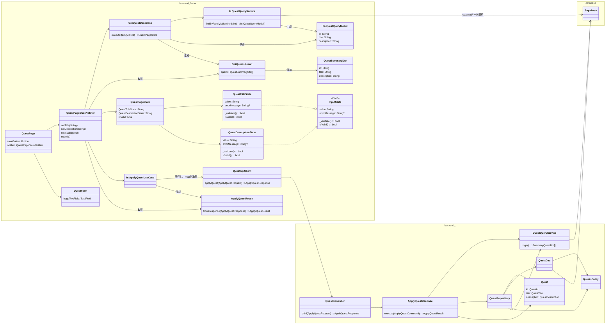
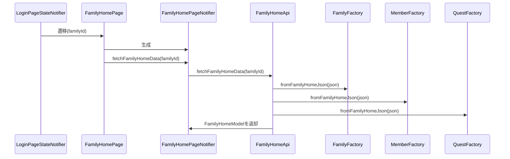

```mermaid
classDiagram
    direction LR
    namespace frontend_flutter {
        class QuestPage {
            saveButton: Button
            notifier: QuestPageStateNotifier
        }
        class QuestForm {
            hogeTextField: TextField
        }
        class QuestPageStateNotifier {
            setTitle(String)
            setDescription(String)
            setIsValid(bool)
            submit()
        }
        class QuestSummaryDto {
            id: String
            title: String
            description: String
        }
        class GetQuestsResult {
            quests: QuestSummaryDto[]
        }

        class GetQuestsUseCase {
            execute(familyId: int): QuestPageState
        }
        class fe.QuestQueryService {
            findByFamilyId(familyId: int): fe.QuestQueryModel[]
        }
        class fe.QuestQueryModel {
            id: String
            title: String
            description: String
        }

        class fe.ApplyQuestUseCase

        class ApplyQuestResult {
            fromResponse(ApplyQuestResponse): ApplyQuestResult
        }

        class QuestApiClient {
            applyQuest(ApplyQuestRequest): ApplyQuestResponse
        }
        
        class QuestPageState {
            QuestTitleState: String
            QuestDescriptionState: String
            isValid: bool
        }

        class InputState {
            <<mixin>>
            value: String
            errorMessage: String?
            _validate(): bool
            isValid(): bool
        }

        class QuestTitleState {
            value: String
            errorMessage: String?
            _validate(): bool
            isValid(): bool
        }
        class QuestDescriptionState {
            value: String
            errorMessage: String?
            _validate(): bool
            isValid(): bool
        }
    }

    namespace backend_ {
        class QuestController {
            child(ApplyQuestRequest): ApplyQuestResponse
        }

        class Quest {
            id: QuestId
            title: QuestTitle
            description: QuestDescription
        }

        class ApplyQuestUseCase {
            execute(ApplyQuestCommand): ApplyQuestResult
        }
        class QuestQueryService {
            hoge(): SummaryQuestDto[]
        }
        class QuestRepository
        class QuestDao
        class QuestsEntity
    }

    namespace database {
        class Supabase
    }


    QuestPage --> QuestPageStateNotifier
    QuestPage --> QuestForm
    QuestPageStateNotifier --> GetQuestsUseCase
    GetQuestsUseCase --> fe.QuestQueryService
    fe.QuestQueryService --> Supabase: realtimeデータ同期
    fe.QuestQueryService --> fe.QuestQueryModel:  生成
    GetQuestsUseCase --> fe.QuestQueryModel: 取得
    GetQuestsUseCase --> GetQuestsResult: 生成
    QuestPageStateNotifier --> GetQuestsResult: 取得
    GetQuestsResult --> QuestSummaryDto: 保持

    QuestPageStateNotifier --> QuestPageState
    QuestPageState --> QuestTitleState
    QuestPageState --> QuestDescriptionState

    QuestTitleState ..|> InputState
    QuestDescriptionState ..|> InputState
    
    QuestPageStateNotifier --> fe.ApplyQuestUseCase
    fe.ApplyQuestUseCase --> QuestApiClient: 実行し、mapを取得
    fe.ApplyQuestUseCase --> ApplyQuestResult: 生成
    QuestPageStateNotifier --> ApplyQuestResult: 取得
    
    QuestApiClient --> QuestController
    QuestController --> ApplyQuestUseCase

    ApplyQuestUseCase --> QuestQueryService
    ApplyQuestUseCase --> QuestRepository
    ApplyQuestUseCase --> Quest
    QuestQueryService --> Supabase
    QuestRepository --> Quest
    QuestRepository --> QuestDao
    QuestRepository --> QuestsEntity
    QuestRepository --> QuestQueryService
    QuestDao --> QuestsEntity
    QuestDao --> Supabase
```

## ログイン周り

```mermaid
sequenceDiagram
    LoginPageStateNotifier ->> FamilyHomePage: 遷移(familyId)
    FamilyHomePage ->> FamilyHomePageNotifier: 生成
    FamilyHomePage ->> FamilyHomePageNotifier: fetchFamilyHomeData(familyId)
    FamilyHomePageNotifier ->> FamilyHomeApi: fetchFamilyHomeData(familyId)
    FamilyHomeApi ->> FamilyFactory: fromFamilyHomeJson(json)
    FamilyHomeApi ->> MemberFactory: fromFamilyHomeJson(json)
    FamilyHomeApi ->> QuestFactory: fromFamilyHomeJson(json)
    FamilyHomeApi ->> FamilyHomePageNotifier: FamilyHomeModelを返却
```

```mermaid
sequenceDiagram
    LoginPageStateNotifier ->> supabase
```
