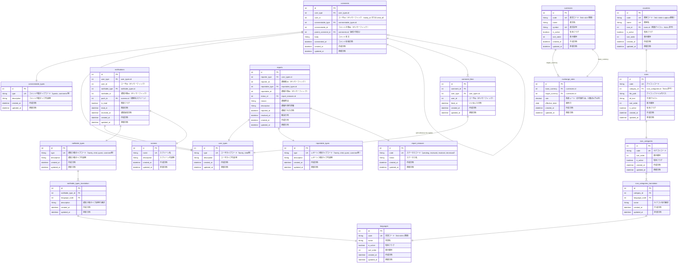

````markdown

```mermaid
erDiagram

    comments {
        %% コメントを管理するテーブル
        int id PK
        int user_type FK "user_types.id"
        int user_id "ユーザID（ポリモーフィック：family_id または child_id）"
        int commentable_type FK "commentable_types.id"
        int commentable_id "コメント対象ID（ポリモーフィック）"
        int parent_comment_id FK "comments.id（返信の場合）"
        String body "コメント本文"
        datetime commented_at "コメント投稿日時"
        datetime created_at "作成日時"
        datetime updated_at "更新日時"
    }

    comments ||--|| commentable_types: ""

    commentable_types {
        %% コメント可能なオブジェクトのタイプ
        int id PK
        String type UK "コメント可能タイプコード（quests, comments等）"
        String description "コメント可能タイプの説明"
        datetime created_at "作成日時"
        datetime updated_at "更新日時"
    }

    comments ||--|| user_types: ""

    user_types {
        %% ユーザのタイプを分類
        int id PK
        String type UK "ユーザタイプコード（family, child等）"
        String description "ユーザタイプの説明"
        datetime created_at "作成日時"
        datetime updated_at "更新日時"
    }

    comments ||--o| comments: "self-reference for replies"

    comments ||--|{ comment_likes: ""

    comment_likes {
        %% コメントへのいいね
        int id PK
        int comment_id FK
        int user_type FK "user_types.id"
        int user_id "ユーザID（ポリモーフィック）"
        datetime liked_at "いいねした日時"
        datetime created_at "作成日時"
        datetime updated_at "更新日時"
    }

    comment_likes ||--|| user_types: ""

    notifications {
        %% ユーザへの通知
        int id PK
        int user_type FK "user_types.id"
        int user_id "ユーザID（ポリモーフィック）"
        int notifiable_type FK "notifiable_types.id"
        int notifiable_id "通知対象ID（ポリモーフィック）"
        int push_to FK "screens.id（遷移先スクリーン）"
        boolean is_read "既読フラグ"
        datetime read_at "既読日時"
        datetime received_at "通知受信日時"
        datetime created_at "作成日時"
        datetime updated_at "更新日時"
    }

    notifications ||--|| user_types: ""
    notifications ||--|| notifiable_types: ""
    notifications ||--|| screens: ""

    notifiable_types {
        %% 通知対象となるオブジェクトのタイプ
        int id PK
        String type UK "通知対象タイプコード（family, child, quest, comment等）"
        String description "通知対象タイプの説明"
        datetime created_at "作成日時"
        datetime updated_at "更新日時"
    }

    notifiable_types ||--|{ notifiable_types_translation: ""

    notifiable_types_translation {
        int id PK
        int notifiable_type_id FK
        int language_code FK
        String description "通知対象タイプ説明の翻訳"
        datetime created_at "作成日時"
        datetime updated_at "更新日時"
    }

    screens {
        %% アプリケーションの画面/ページ
        int id PK
        String name UK "スクリーン名"
        String description "スクリーンの説明"
        datetime created_at "作成日時"
        datetime updated_at "更新日時"
    }

    reports {
        %% 通報テーブル
        int id PK
        int reporter_type FK "user_types.id"
        int reporter_id "通報者ID（ポリモーフィック）"
        int reportable_type FK "reportable_types.id"
        int reportable_id "通報対象ID（ポリモーフィック）"
        int status_id FK "report_statuses.id"
        String reason "通報理由"
        String description "通報内容の詳細"
        datetime reported_at "通報された日時"
        datetime resolved_at "解決日時"
        datetime created_at "作成日時"
        datetime updated_at "更新日時"
    }

    reports ||--|| user_types: ""
    reports ||--|| reportable_types: ""
    reports ||--|| report_statuses: ""

    reportable_types {
        %% レポート対象となるオブジェクトのタイプ
        int id PK
        String type UK "レポート対象タイプコード（family, child, quest, comment等）"
        String description "レポート対象タイプの説明"
        datetime created_at "作成日時"
        datetime updated_at "更新日時"
    }

    report_statuses {
        %% レポートの処理状態
        int id PK
        String code UK "ステータスコード（pending, reviewed, resolved, dismissed）"
        String status "ステータス名"
        datetime created_at "作成日時"
        datetime updated_at "更新日時"
    }

    icons {
        %% アイコン情報
        int id PK
        String code UK "アイコンコード"
        int category_id FK "icon_categories.id（NULL許可）"
        String file_path "アイコンファイルのパス"
        String alt_text "代替テキスト"
        int sort_order "表示順序"
        boolean is_active "有効フラグ"
        datetime created_at "作成日時"
        datetime updated_at "更新日時"
    }

    icons ||--|| icon_categories: ""

    icon_categories {
        %% アイコンのカテゴリ
        int id PK
        String code UK "カテゴリコード"
        int sort_order "表示順序"
        boolean is_active "有効フラグ"
        datetime created_at "作成日時"
        datetime updated_at "更新日時"
    }

    icon_categories ||--|{ icon_categories_translation: ""

    icon_categories_translation {
        int id PK
        int category_id FK
        int language_code FK
        String name "カテゴリ名の翻訳"
        datetime created_at "作成日時"
        datetime updated_at "更新日時"
    }

    languages {
        %% 言語マスタテーブル
        int id PK
        String code UK "言語コード（ISO 639-1準拠）"
        String name "言語名"
        boolean is_active "有効フラグ"
        int sort_order "表示順序"
        datetime created_at "作成日時"
        datetime updated_at "更新日時"
    }

    notifiable_types_translation ||--|| languages: ""
    icon_categories_translation ||--|| languages: ""

    currencies {
        %% 通貨情報
        int id PK
        String code UK "通貨コード（ISO 4217準拠）"
        String name "通貨名"
        String symbol UK "通貨記号"
        boolean is_active "有効フラグ"
        int sort_order "表示順序"
        datetime created_at "作成日時"
        datetime updated_at "更新日時"
    }

    exchange_rates {
        %% 通貨間の為替レート
        int id PK
        int base_currency FK "currencies.id"
        int target_currency FK "currencies.id"
        decimal rate "為替レート（正の値のみ、小数点以下6桁）"
        date effective_date "適用日"
        datetime created_at "作成日時"
        datetime updated_at "更新日時"
    }

    exchange_rates ||--|| currencies: "base_currency"
    currencies ||--|{ exchange_rates: "target_currency"

    countries {
        %% 国家情報
        int id PK
        String code UK "国家コード（ISO 3166-1 alpha-3準拠）"
        String name UK "国家名"
        int icon_id FK "icons.id（国旗アイコン、NULL許可）"
        boolean is_active "有効フラグ"
        int sort_order "表示順序"
        datetime created_at "作成日時"
        datetime updated_at "更新日時"
    }

    countries ||--|| icons: ""
```

````
