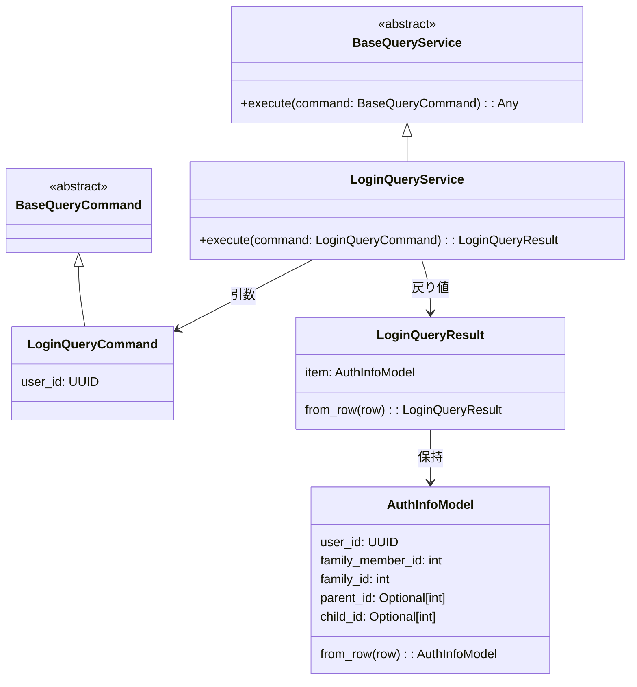

# LoginQueryService関連

## `LoginQueryService`関連

```mermaid
classDiagram
    class BaseQueryService {
        <<abstract>>
        +execute(command: BaseQueryCommand): Any
    }
    class BaseQueryCommand {
        <<abstract>>
    }
    class LoginQueryService {
        +execute(command: LoginQueryCommand): LoginQueryResult
    }
    class LoginQueryCommand {
        user_id: UUID
    }
    class LoginQueryResult {
        item: AuthInfoModel
        from_row(row): LoginQueryResult
    }
    class AuthInfoModel {
        user_id: UUID
        family_member_id: int
        family_id: int
        parent_id: Optional[int]
        child_id: Optional[int]
        from_row(row): AuthInfoModel
    }

    BaseQueryCommand <|-- LoginQueryCommand
    BaseQueryService <|-- LoginQueryService
    LoginQueryService --> LoginQueryCommand : 引数
    LoginQueryService --> LoginQueryResult : 戻り値
    LoginQueryResult --> AuthInfoModel : 保持
```
