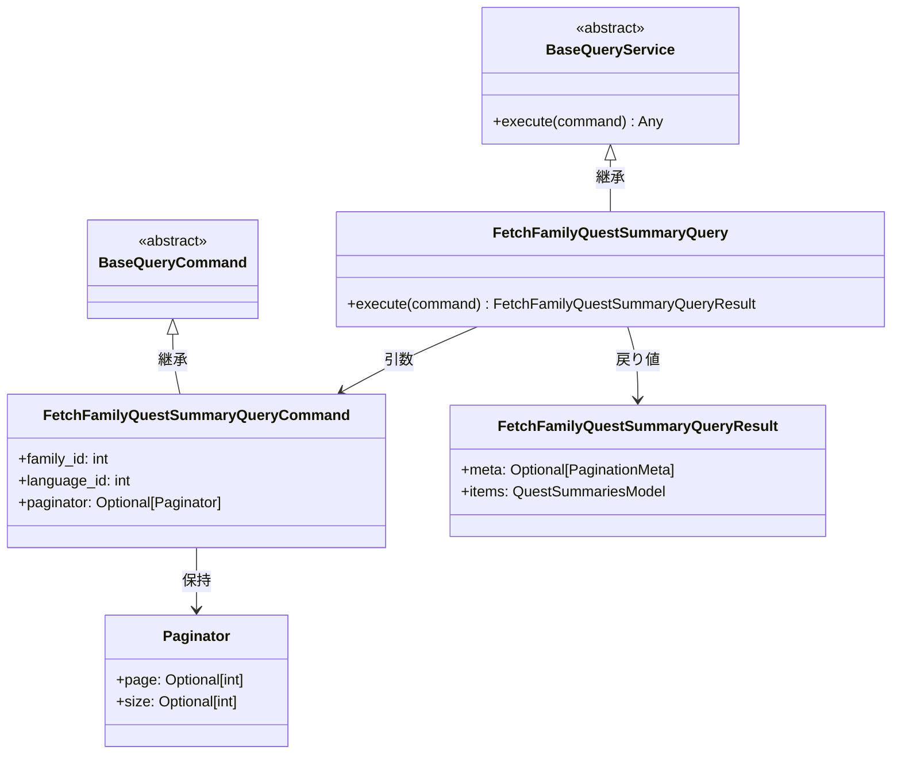

# FetchFamilyQuestSummaryQuery クラス図

## FetchFamilyQuestSummaryQuery関連

```mermaid
classDiagram
    class BaseQueryService {
        <<abstract>>
        +execute(command) Any
    }
    
    class BaseQueryCommand {
        <<abstract>>
    }
    
    class FetchFamilyQuestSummaryQuery {
        +execute(command) FetchFamilyQuestSummaryQueryResult
    }
    
    class FetchFamilyQuestSummaryQueryCommand {
        +family_id: int
        +language_id: int
        +paginator: Optional[Paginator]
    }
    
    class FetchFamilyQuestSummaryQueryResult {
        +meta: Optional[PaginationMeta]
        +items: QuestSummariesModel
    }
    
    class Paginator {
        +page: Optional[int]
        +size: Optional[int]
    }
    
    %% 関係性
    BaseQueryService <|-- FetchFamilyQuestSummaryQuery : 継承
    FetchFamilyQuestSummaryQuery --> FetchFamilyQuestSummaryQueryCommand : 引数
    FetchFamilyQuestSummaryQuery --> FetchFamilyQuestSummaryQueryResult : 戻り値
    BaseQueryCommand <|-- FetchFamilyQuestSummaryQueryCommand : 継承
    FetchFamilyQuestSummaryQueryCommand --> Paginator : 保持
```
