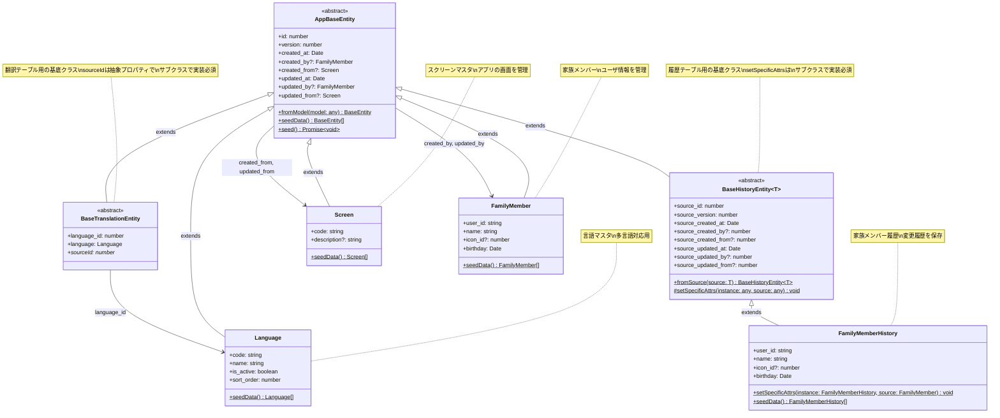

# BaseEntity クラス図

## 概要
- TypeScriptでBaseTranslationEntity、BaseHistoryEntityを実装
- Python版を参考にしながらTypeORMに対応した構造で作成
- FastAPIのエンティティを参考に具体的なエンティティも作成

## クラス図



## 作成したエンティティ

### 1. 基底クラス
- **AppBaseEntity**: 全エンティティの基底クラス（既存）
- **BaseTranslationEntity**: 翻訳テーブル用の基底クラス
- **BaseHistoryEntity**: 履歴テーブル用の基底クラス

### 2. 具体的なエンティティ
- **Screen**: スクリーンマスタエンティティ
- **Language**: 言語マスタエンティティ  
- **FamilyMember**: 家族メンバーエンティティ
- **FamilyMemberHistory**: 家族メンバー履歴エンティティ

## 実装のポイント

### BaseTranslationEntity
- Python版の`BaseTranslationEntity`を参考に実装
- `language_id`フィールドとLanguageエンティティとのリレーションを持つ
- `sourceId`は抽象プロパティとして定義（サブクラスで実装必須）

### BaseHistoryEntity
- Python版の`BaseHistoryEntity`を参考に実装
- ジェネリクス`<T extends AppBaseEntity>`を使用して型安全性を確保
- `fromSource`メソッドで元のエンティティから履歴エンティティを生成
- `setSpecificAttrs`メソッドはサブクラスで実装必須（anyで型制約を回避）

### Screen
- FastAPIの`ScreensEntity`を参考に実装
- アプリケーションの画面を管理するマスタテーブル
- シードデータで基本的な画面情報を提供

### Language
- FastAPIの`LanguagesEntity`を参考に実装
- 多言語対応のための言語マスタテーブル
- 日本語・英語の初期データをシード

### FamilyMember
- FastAPIの`FamilyMembersEntity`を参考に実装
- ユーザーの家族メンバー情報を管理
- Check制約で名前の空文字チェックと誕生日の未来日チェックを追加

### FamilyMemberHistory
- FastAPIの`FamilyMembersHistoryEntity`を参考に実装
- FamilyMemberの変更履歴を保存
- `setSpecificAttrs`メソッドでFamilyMember固有の属性をコピー

## 使用例

### BaseTranslationEntityのサブクラス例
```typescript
@Entity("quest_translations")
export class QuestTranslation extends BaseTranslationEntity {
  @Column({ type: "int" })
  quest_id!: number;

  @Column({ type: "varchar", length: 255 })
  title!: string;

  @Column({ type: "text" })
  description!: string;

  get sourceId(): number {
    return this.quest_id;
  }
}
```

### BaseHistoryEntityのサブクラス例
```typescript
@Entity("quest_history")
export class QuestHistory extends BaseHistoryEntity<Quest> {
  @Column({ type: "varchar", length: 255 })
  title!: string;

  @Column({ type: "text" })
  description!: string;

  protected static setSpecificAttrs(instance: QuestHistory, source: Quest): void {
    instance.title = source.title;
    instance.description = source.description;
  }
}
```
