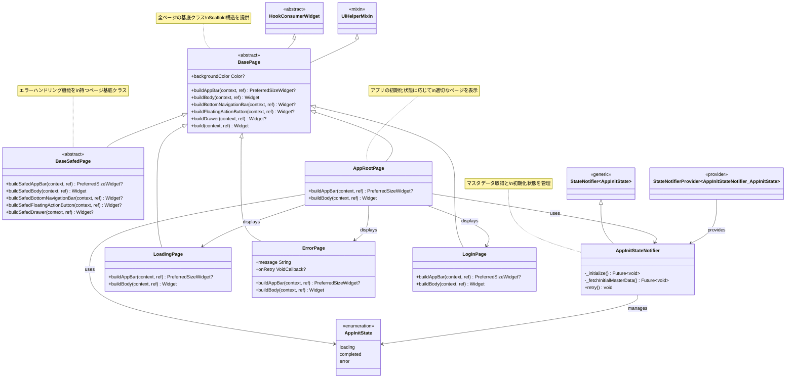

## クラス図


# app_root_page

アプリのルートページを管理するコンポーネントです。

## 概要

`AppRootPage`は、アプリの初期化状態に応じて適切なページを表示するルートページです。

## 機能

- アプリ初期化時の状態管理
- 初期化中のローディング画面表示
- エラー時のエラー画面表示
- 初期化完了後のログインページ表示

## アーキテクチャ

### ページ継承構造
- `HookConsumerWidget` (Flutter/Riverpod基底)
  - `BasePage` (アプリ共通ページ基底)
    - `BaseSafedPage` (エラーハンドリング付きページ基底)
    - `AppRootPage` (アプリルートページ)
    - `LoadingPage` (ローディングページ)
    - `ErrorPage` (エラーページ)
    - `LoginPage` (ログインページ)

### 状態管理
- `StateNotifier<AppInitState>` (Riverpod状態管理基底)
  - `AppInitStateNotifier` (アプリ初期化状態管理)
- `AppInitState` (初期化状態列挙型)

## コンポーネント構成

### AppRootPage
- `BasePage`を継承したルートページコンポーネント
- アプリバーは表示しない設定
- 初期化状態に応じて適切なページをswitchで切り替え

### component/app_init_state_notifier.dart
- アプリ初期化状態を管理するStateNotifier
- マスタデータ取得処理
- 再初期化機能

## 状態管理

### AppInitState
- `loading`: 初期化中
- `completed`: 初期化完了
- `error`: 初期化エラー

### AppInitStateNotifier
- アプリの初期化処理を実行
- エラー時の再試行機能を提供
- マスタデータ取得のUsecaseを呼び出し

## 使用方法

```dart
// main.dartから呼び出し
class MyApp extends StatelessWidget {
  @override
  Widget build(BuildContext context) {
    return MaterialApp(
      home: ProviderScope(
        child: AppRootPage(),
      ),
    );
  }
}
```

## 関連ページ

- `LoadingPage`: 初期化中に表示
- `ErrorPage`: エラー時に表示（リトライ機能付き）
- `LoginPage`: 初期化完了後に表示

## 設計方針

- BasePage継承によるページ構造の統一
- StateNotifierによる状態管理の分離
- コンポーネント分割によるコードの可読性向上
- エラーハンドリングとリトライ機能の実装
