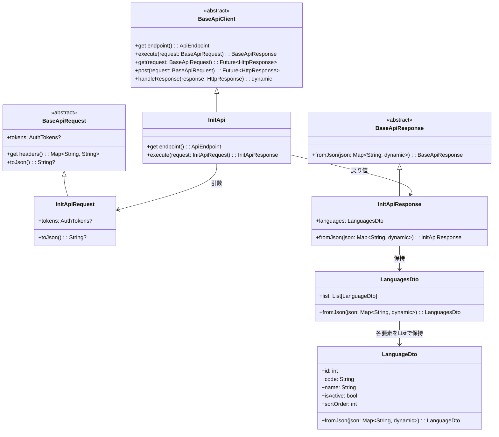

# init関連

## InitApi関連

```mermaid
classDiagram
    class InitApi {
        +get endpoint(): ApiEndpoint
        +execute(request: InitApiRequest): InitApiResponse
    }
    class BaseApiClient {
        <<abstract>>
        +get endpoint(): ApiEndpoint
        +execute(request: BaseApiRequest): BaseApiResponse
        +get(request: BaseApiRequest): Future~HttpResponse~
        +post(request: BaseApiRequest): Future~HttpResponse~
        +handleResponse(response: HttpResponse): dynamic
    }
    class InitApiRequest {
        +tokens: AuthTokens?
        +toJson(): String?
    }
    class BaseApiRequest {
        <<abstract>>
        +tokens: AuthTokens?
        +get headers(): Map~String, String~
        +toJson(): String?
    }
    class InitApiResponse {
        +languages: LanguagesDto
        +fromJson(json: Map~String, dynamic~): InitApiResponse
    }
    class BaseApiResponse {
        <<abstract>>
        +fromJson(json: Map~String, dynamic~): BaseApiResponse
    }
    class LanguagesDto {
        +list: List[LanguageDto]
        +fromJson(json: Map~String, dynamic~): LanguagesDto
    }
    class LanguageDto {
        +id: int
        +code: String
        +name: String
        +isActive: bool
        +sortOrder: int
        +fromJson(json: Map~String, dynamic~): LanguageDto
    }

    BaseApiClient <|-- InitApi
    BaseApiRequest <|-- InitApiRequest
    BaseApiResponse <|-- InitApiResponse
    InitApi --> InitApiRequest : 引数
    InitApi --> InitApiResponse : 戻り値
    InitApiResponse --> LanguagesDto : 保持
    LanguagesDto --> LanguageDto : 各要素をListで保持
```
