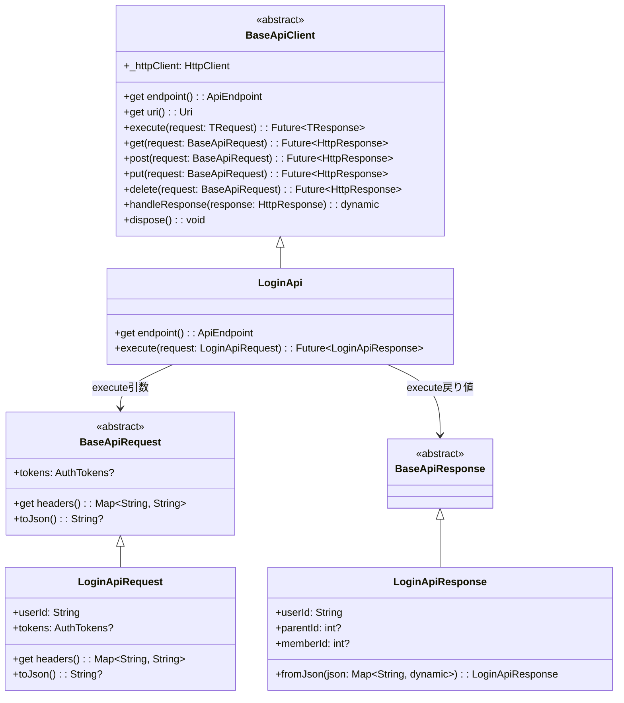

# LoginApi関連

## `LoginApi`関連

```mermaid
classDiagram
    class BaseApiClient {
        <<abstract>>
        +_httpClient: HttpClient
        +get endpoint(): ApiEndpoint
        +get uri(): Uri
        +execute(request: TRequest): Future~TResponse~
        +get(request: BaseApiRequest): Future~HttpResponse~
        +post(request: BaseApiRequest): Future~HttpResponse~
        +put(request: BaseApiRequest): Future~HttpResponse~
        +delete(request: BaseApiRequest): Future~HttpResponse~
        +handleResponse(response: HttpResponse): dynamic
        +dispose(): void
    }
    
    class LoginApi {
        +get endpoint(): ApiEndpoint
        +execute(request: LoginApiRequest): Future~LoginApiResponse~
    }
    
    class BaseApiRequest {
        <<abstract>>
        +tokens: AuthTokens?
        +get headers(): Map~String, String~
        +toJson(): String?
    }
    
    class LoginApiRequest {
        +userId: String
        +tokens: AuthTokens?
        +get headers(): Map~String, String~
        +toJson(): String?
    }
    
    class BaseApiResponse {
        <<abstract>>
    }
    
    class LoginApiResponse {
        +userId: String
        +parentId: int?
        +memberId: int?
        +fromJson(json: Map~String, dynamic~): LoginApiResponse
    }

    BaseApiClient <|-- LoginApi
    BaseApiRequest <|-- LoginApiRequest
    BaseApiResponse <|-- LoginApiResponse
    LoginApi --> BaseApiRequest : execute引数
    LoginApi --> BaseApiResponse : execute戻り値
```
