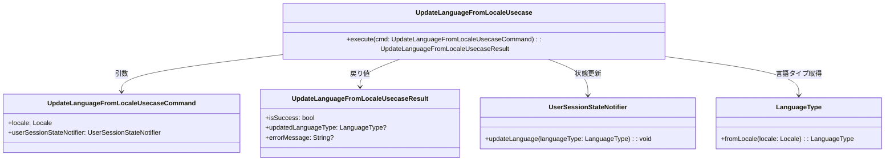

# UpdateLanguageFromLocaleUsecase クラス図

## 概要
Flutter内部のLocaleオブジェクトから言語タイプを判定し、UserSessionStateNotifierの状態を更新するユースケース

## クラス図


## 処理フロー
1. `UpdateLanguageFromLocaleUsecaseCommand`からLocaleを取得
2. `LanguageType.fromLocale()`でLocaleから対応する言語タイプを取得
3. `UserSessionStateNotifier.updateLanguage()`で状態を更新
4. 結果を`UpdateLanguageFromLocaleUsecaseResult`として返却

## 使用例
```dart
final usecase = UpdateLanguageFromLocaleUsecase();
final cmd = UpdateLanguageFromLocaleUsecaseCommand(
  locale: Locale('ja', 'JP'),
  userSessionStateNotifier: userSessionStateNotifier,
);

final result = await usecase.execute(cmd);
if (result.isSuccess) {
  print('言語が ${result.updatedLanguageType} に更新されました');
}
```
